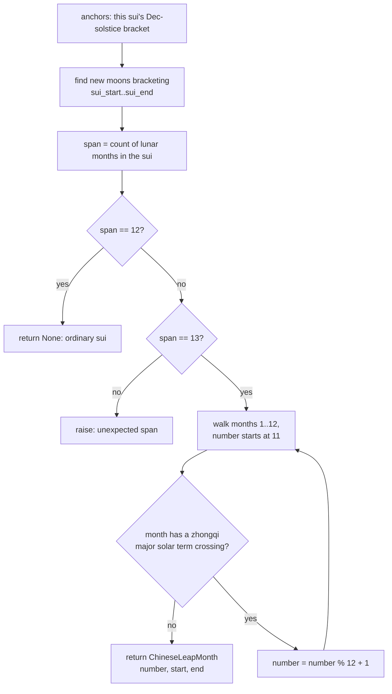

# Blue Moon — Flow

**About:** [description](../__about/blue_moon.md)

## Algorithm — `thirteenth_candidates`

```mermaid
flowchart TB
    A[on_date, moon_window, anchors, leap] --> B{leap set AND\nleap.start <= on_date <= leap.end?}
    B -- yes --> C[add "chinese"]
    B -- no --> D[skip]
    C --> E{thirteen_moon_year(year)?}
    D --> E
    E -- yes --> F{on_date in ophiuchus_window?}
    E -- no --> H[skip Ophiuchus/Sol]
    F -- yes --> G[add "ophiuchus"]
    F -- no --> H
    G --> I{on_date in sol_window?}
    H --> I
    I -- yes --> J[add "sol"]
    I -- no --> K
    J --> K{on_date in modrenik_window\nof either Dec solstice AND\nthat year is a 13-moon year?}
    K -- yes --> L[add "modrenik"]
    K -- no --> M
    L --> M[union with AXLE_ALWAYS_CENTERS]
    M --> N[return frozenset of candidates]
```

## Algorithm — `chinese_leap_month`



Pseudocode (language-neutral):

    FUNCTION thirteenth_candidates(on_date, moon_window, anchors, leap):
        found = {}
        IF leap is not None AND leap.start <= on_date <= leap.end:
            found.add("chinese")
        year = on_date.year
        IF thirteen_moon_year(year, moon_window):
            IF on_date in ophiuchus_window(year): found.add("ophiuchus")
            IF on_date in sol_window(year):       found.add("sol")
        FOR (solstice, solstice_year) IN [(this year's Dec solstice, year),
                                           (last year's Dec solstice, year-1)]:
            IF on_date in modrenik_window(solstice)
               AND thirteen_moon_year(solstice_year, moon_window):
                found.add("modrenik")
        RETURN found UNION AXLE_ALWAYS_CENTERS   # always present, no trigger

    FUNCTION chinese_leap_month(anchors, window):
        new_moons = sorted new-moon instants inside [sui_start, sui_end]
        span = number of lunar months between the two December solstices
        IF span == 12: RETURN None
        ASSERT span == 13
        number = 11                                # the solstice month
        FOR each lunar month segment j = 1..12:
            IF segment j has NO zhongqi (solar-longitude 30-deg crossing):
                RETURN ChineseLeapMonth(number, segment_start, segment_end)
            number = number MOD 12 + 1
