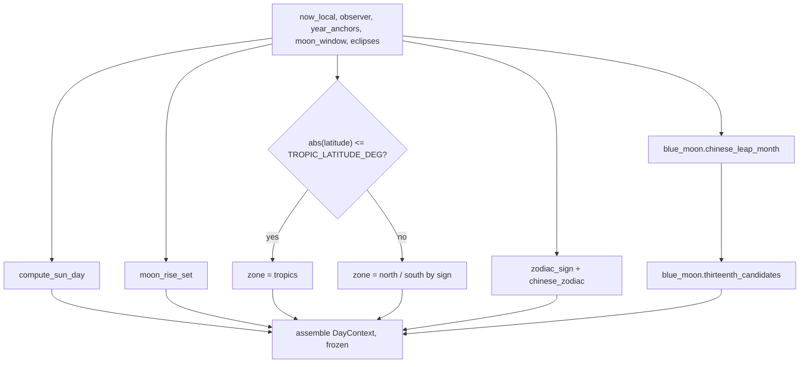
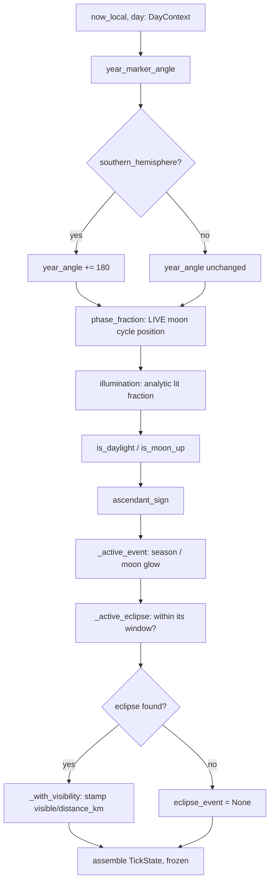

# Clock State — Flow

**About:** [description](../__about/clock_state.md)

## Algorithm — `build_day_context` (once per local day / UTC-offset change)



## Algorithm — `build_tick_state` (once per minute)



## Algorithm — `_active_eclipse` / `_with_visibility`

```mermaid
flowchart TB
    A[for each catalog EclipseEvent] --> B{abs(now - event.instant) <= window?}
    B -- no --> A
    B -- yes --> C{kind == lunar?}
    C -- yes --> D[visible = moon elevation > 0]
    C -- no --> E{lat/lon known?}
    E -- no --> F[visible = sun elevation > horizon]
    E -- yes --> G[distance = haversine to lat,lon]
    G --> H[visible = sun above horizon\nAND distance <= ECLIPSE_SOLAR_VISIBILITY_KM]
    D --> I[return stamped event]
    F --> I
    H --> I
```

Pseudocode (language-neutral):

    FUNCTION build_day_context(now_local, observer, year_anchors, moon_window, eclipses):
        sun_day = compute_sun_day(observer, now_local.date, now_local.tz)
        moonrise, moonset = moon_rise_set(observer, now_local.date, now_local.tz)
        zone = "tropics" IF abs(observer.latitude) <= TROPIC_LATITUDE_DEG
               ELSE ("south" IF observer.latitude < 0 ELSE "north")
        leap = blue_moon.chinese_leap_month(year_anchors, moon_window)
        candidates = blue_moon.thirteenth_candidates(now_local.date, moon_window,
                                                       year_anchors, leap)
        RETURN DayContext(... every field above ..., eclipses=eclipses,
                           thirteenth_candidates=candidates)

    FUNCTION build_tick_state(now_local, day):
        year_angle = year_marker_angle(now_local, day.year_anchors)
        IF day.southern_hemisphere: year_angle = (year_angle + 180) MOD 360
        RETURN TickState(
            hour_angle=time_to_dial_angle(now_local),
            minute_angle=minute_hand_angle(now_local),
            year_angle=year_angle,
            moon_fraction=phase_fraction(now_local, day.moon_window),
            moon_illumination=illumination(now_local, day.deep_cycles),
            is_daylight=_is_daylight(now_local, day.sun),
            is_moon_up=_is_moon_up(now_local, day),
            ascendant_sign=ascendant_sign(now_local, day.latitude, day.longitude),
            season_event=_active_event(now_local, day.season_events, SEASON_GLOW_WINDOW_H),
            moon_event=_active_event(now_local, day.moon_events, MOON_GLOW_WINDOW_H),
            eclipse_event=_active_eclipse(now_local, day, ECLIPSE_GLOW_WINDOW_H),
        )
