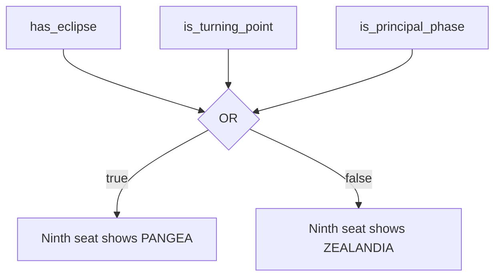
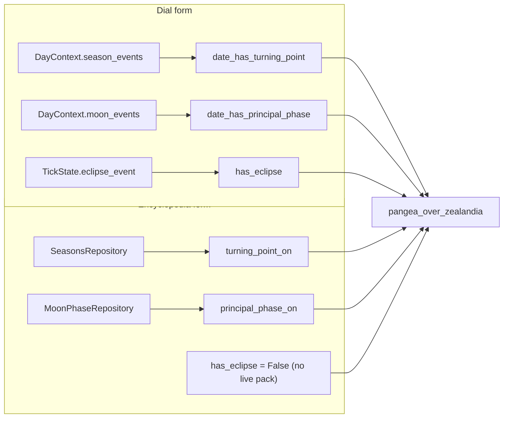

# Continents — Flow

**About:** [description](../__about/continents.md)

## Algorithm

Two thin wrappers feed the same law from different data shapes:

Pseudocode (language-neutral):

    FUNCTION pangea_over_zealandia(has_eclipse, is_turning_point, is_principal_phase):
        RETURN has_eclipse OR is_turning_point OR is_principal_phase

    FUNCTION ninth_is_pangea_from_events(on_date, season_events, moon_events, has_eclipse):
        turning = ANY(instant.date == on_date FOR instant, _ IN season_events)
        principal = ANY(instant.date == on_date AND name IN PRINCIPAL_NAMES
                         FOR instant, name IN moon_events)
        RETURN pangea_over_zealandia(has_eclipse, turning, principal)

    FUNCTION ninth_is_pangea_from_repos(on_date, seasons_repo, moon_repo, has_eclipse=False):
        TRY: anchors = seasons_repo.year_anchors(on_date.year)
             turning = ANY(instant.date == on_date FOR instant IN anchors.instants)
        EXCEPT (not covered): turning = False
        TRY: window = moon_repo.moon_window(on_date.year)
             principal = ANY(instant.date == on_date AND fraction IN {0, 0.25, 0.5, 0.75}
                              FOR instant, fraction IN window.events)
        EXCEPT (not covered): principal = False
        RETURN pangea_over_zealandia(has_eclipse, turning, principal)
