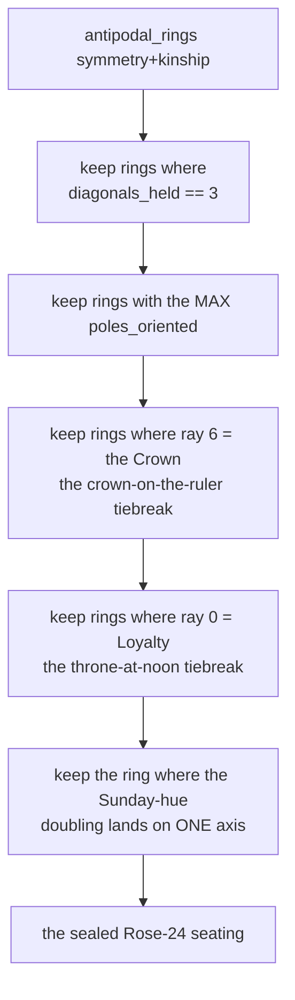

# Cube Seating — Flow

**About:** [description](../__about/cube_seating.md)

## Algorithm — `antipodal_rings` (exhaustive backtracking search)

```mermaid
flowchart TB
    A[start: empty path, empty axes-used set] --> B{path length == 12?}
    B -- yes --> C{is_kin(path[-1], antipode(path[0]))?}
    C -- yes --> D[emit ring: path + antipodes of path]
    C -- no --> E[backtrack]
    B -- no --> F[for each unused human cell]
    F --> G{axis already used\nOR not kin with path[-1]?}
    G -- yes --> F
    G -- no --> H{symmetric mode AND\nrank != required_rank for this ray?}
    H -- yes --> F
    H -- no --> I[append cell, mark axis used]
    I --> B
    D --> Z[all 12 rays walked -> 24-ray ring]
```

## Algorithm — `solve_rose_seating` (laws in authority order)



Pseudocode (language-neutral):

    FUNCTION antipodal_rings(symmetric=True):
        rings = []
        FUNCTION walk(path, axes_used):
            IF length(path) == 12:
                IF is_kin(path[-1], antipode(path[0])):
                    rings.append(path + [antipode(c) FOR c IN path])
                RETURN
            ray = length(path)
            FOR cell IN all_human_cells (sorted):
                IF axis_key(cell) IN axes_used: CONTINUE
                IF path is not empty AND NOT is_kin(path[-1], cell): CONTINUE
                IF symmetric AND rank(cell) != required_rank(ray): CONTINUE
                path.append(cell); axes_used.add(axis_key(cell))
                walk(path, axes_used)
                path.pop(); axes_used.remove(axis_key(cell))
        walk([], {})
        RETURN rings

    FUNCTION solve_rose_seating():
        rings = antipodal_rings()                                # symmetry + kinship
        best = FILTER(rings, diagonals_held(r) == 3)              # colour law
        top = MAX(poles_oriented(r) FOR r IN best)
        best = FILTER(best, poles_oriented(r) == top)
        best = FILTER(best, r[6] == CROWN)                        # crown on the Ruler
        best = FILTER(best, r[0] == LOYALTY)                      # throne at noon
        RETURN FILTER(best, the Sunday-hue doubling falls on exactly one axis)

    FUNCTION calendar_seating(inverted=False):
        wedges = CALENDAR_WEDGES_BY_FAMILY
        IF inverted: swap wedges["primary"] and wedges["tertiary"]
        FOR family, axis_names IN CALENDAR_AXIS_ORDER:
            FOR wedge, name IN zip(wedges[family], axis_names):
                axis = the human axis named `name`
                outer = the end whose first nonzero of (x, z, y) is +1
                inner = the other end
                emit CalendarArm(month, wedge, family, axis, inner, outer)
