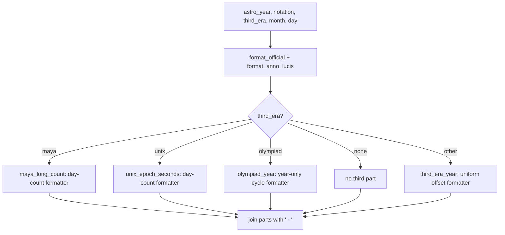
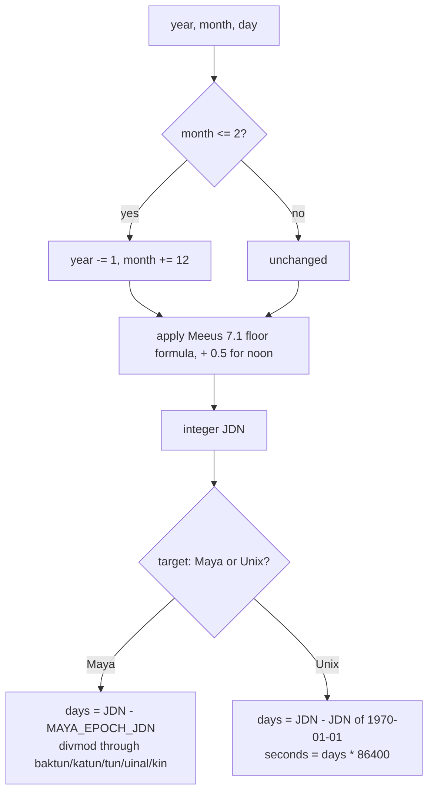

# Deep Time — Flow

**About:** [description](../__about/deep_time.md)

## Algorithm — `format_year_line` (the third-era dispatch)



## Algorithm — `julian_day` -> `maya_long_count` / `unix_epoch_seconds`



## Algorithm — `proxy_cycles` (the 400-year window mapping)

```mermaid
flowchart TB
    A[astro_year] --> B{2 <= astro_year <= 9998?}
    B -- yes --> C[cycles = 0]
    B -- no --> D{astro_year < 2?}
    D -- yes --> E[cycles = ceil((PROXY_WINDOW_FIRST - astro_year) / 400)]
    D -- no --> F[cycles = -ceil((astro_year - last_proxy_year) / 400)]
```

Pseudocode (language-neutral):

    FUNCTION format_year_line(astro_year, notation, show_suffix, third_era, month, day):
        parts = [format_official(astro_year, notation, show_suffix),
                 format_anno_lucis(astro_year)]
        IF third_era == "maya":     parts.append(maya_long_count(astro_year, month, day) + " . Maya")
        ELIF third_era == "unix":   parts.append(grouped(unix_epoch_seconds(...)) + " s . Unix")
        ELIF third_era == "olympiad": parts.append(olympiad_year(astro_year))
        ELIF third_era != "none":  parts.append(third_era_year(astro_year, third_era) + " . " + LABEL)
        RETURN " · ".join(parts)

    FUNCTION julian_day(year, month, day, day_fraction=0):
        IF month <= 2: year -= 1; month += 12
        a = floor(year / 100); b = 2 - a + floor(a / 4)
        RETURN floor(365.25*(year+4716)) + floor(30.6001*(month+1)) + day + b - 1524.5 + day_fraction

    FUNCTION maya_long_count(astro_year, month, day):
        jdn = int(julian_day(astro_year, month, day, 0.5))   # noon lands on the integer JDN
        days = jdn - MAYA_EPOCH_JDN
        baktun, days = divmod(days, 144000)
        katun, days  = divmod(days, 7200)
        tun, days    = divmod(days, 360)
        uinal, kin   = divmod(days, 20)
        RETURN f"{baktun}.{katun}.{tun}.{uinal}.{kin}"

    FUNCTION proxy_cycles(astro_year):
        IF 2 <= astro_year <= 9998: RETURN 0
        IF astro_year < 2: RETURN ceil((PROXY_WINDOW_FIRST - astro_year) / 400)
        RETURN -ceil((astro_year - (PROXY_WINDOW_FIRST + 399)) / 400)

    FUNCTION delta_t_seconds(year):
        # nine piecewise polynomial branches by year range (Espenak & Meeus 2006),
        # each a published fit; the two open ends share one parabola:
        #     u = (year - 1820) / 100 ; RETURN -20 + 32 * u^2  (+ a blend term near 2150)
