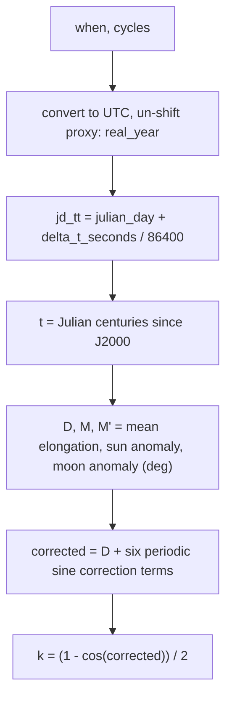

# Moon — Flow

**About:** [description](../__about/moon.md)

## Algorithm — `phase_fraction` (bracketing interpolation)

```mermaid
flowchart TB
    A[now, window.events] --> B{now outside\nfirst..last event?}
    B -- yes --> C[raise ValueError]
    B -- no --> D[find bracketing pair t0, t1]
    D --> E[elapsed = (now - t0) / (t1 - t0)]
    E --> F["fraction = (f0 + elapsed * 0.25) MOD 1.0"]
```

## Algorithm — `illumination` (Meeus 48.4 analytic series)



## Algorithm — `chinese_zodiac` (cusp in China's own frame)

```mermaid
flowchart TB
    A[now_local, window] --> B[china_now = now_local in UTC+8]
    B --> C[year = china_now.year]
    C --> D{china_now.date < CNY of year?}
    D -- yes --> E[year -= 1]
    D -- no --> F[unchanged]
    E --> G[start = _chinese_new_year(year)]
    F --> G
    G --> H[end = _chinese_new_year(year+1) - 1 day]
    H --> I[return chinese_name_of_year(year), start, end]
```

Pseudocode (language-neutral):

    FUNCTION phase_fraction(now, window):
        ASSERT window.events[0].instant <= now <= window.events[-1].instant
        FIND (t0, f0), (t1, _) IN consecutive events WHERE t0 <= now <= t1
        elapsed = (now - t0) / (t1 - t0)
        RETURN (f0 + elapsed * 0.25) MOD 1.0

    FUNCTION illumination(when, cycles=0):
        utc = when in UTC
        year = real_year(utc.year, cycles)
        jd_tt = julian_day(year, utc.month, utc.day, day_fraction) + delta_t_seconds(year)/86400
        t = (jd_tt - 2451545.0) / 36525.0
        D  = 297.8501921 + 445267.1114034*t - ...      # mean elongation of the Moon (deg)
        M  = 357.5291092 + 35999.0502909*t - ...       # sun mean anomaly (deg)
        M' = 134.9633964 + 477198.8675055*t + ...      # moon mean anomaly (deg)
        corrected = D + (6.289*sin(M') - 2.100*sin(M) + 1.274*sin(2D-M')
                          + 0.658*sin(2D) + 0.214*sin(2M') - 0.110*sin(D))
        RETURN (1 - cos(corrected)) / 2

    FUNCTION chinese_zodiac(now_local, window):
        china_now = now_local shifted to UTC+8
        year = china_now.date.year
        start = _chinese_new_year(year, window)
        IF china_now.date < start:
            year -= 1
            start = _chinese_new_year(year, window)
        end = _chinese_new_year(year + 1, window) - 1 day
        RETURN chinese_name_of_year(year), start, end
