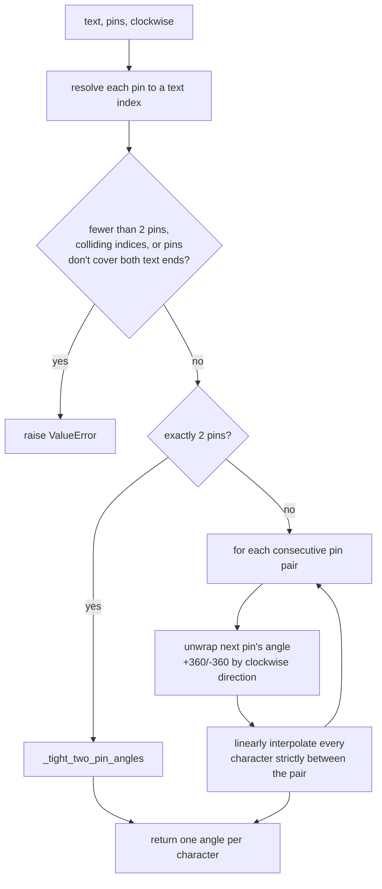
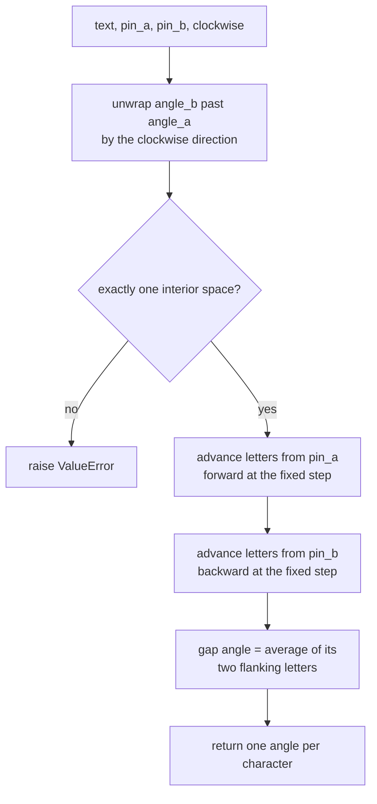

# Motto — Flow

**About:** [description](../__about/motto.md)

## Algorithm — `motto_glyph_angles`

## Algorithm — `_tight_two_pin_angles`

Pseudocode (language-neutral):

    FUNCTION motto_glyph_angles(text, pins, clockwise=True):
        resolved = sorted [(index of the Nth occurrence of letter, ring_position)
                            FOR (letter, occurrence, ring_position) IN pins]
        ASSERT len(resolved) >= 2, no two pins share an index,
               first resolved index == 0, last == len(text) - 1
        IF len(resolved) == 2:
            RETURN _tight_two_pin_angles(text, resolved, clockwise)
        angles[first_index] = ring_position_angle(first_position)
        FOR each subsequent (index, position) IN resolved[1:]:
            angle = ring_position_angle(position)
            WHILE (clockwise AND angle <= prev_angle) OR (NOT clockwise AND angle >= prev_angle):
                angle += 360 IF clockwise ELSE -360
            step = (angle - prev_angle) / (index - prev_index)
            FOR k IN prev_index+1 .. index:
                angles[k] = prev_angle + step * (k - prev_index)
            prev_index, prev_angle = index, angle
        RETURN angles

    FUNCTION _tight_two_pin_angles(text, [(index_a, pos_a), (index_b, pos_b)], clockwise):
        angle_a = ring_position_angle(pos_a)
        angle_b = ring_position_angle(pos_b)
        step = RING_MOTTO_LETTER_STEP_DEG * (1 IF clockwise ELSE -1)
        unwrap angle_b past angle_a in the `clockwise` direction
        ASSERT text has exactly one interior space, at index `gap`
        angles[index_a] = angle_a
        FOR k FROM index_a+1 TO gap-1: angles[k] = angle_a + step*(k - index_a)
        angles[index_b] = angle_b
        FOR k FROM index_b-1 DOWNTO gap+1: angles[k] = angle_b - step*(index_b - k)
        angles[gap] = average(angles[gap-1], angles[gap+1])
        RETURN angles
