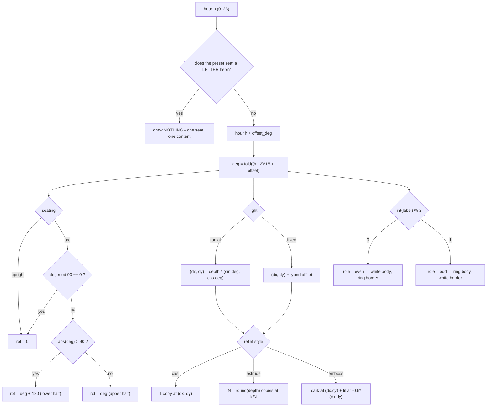
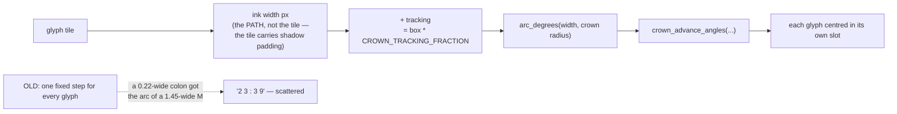

# core/numerals.py — flow

## The band solve



## Pseudocode

```
fold(deg):                       # into (-180, 180]
    d = ((deg + 180) mod 360) - 180
    return 180 if d == -180 else d

hour_angle(h, offset):           return fold((h - 12) * 15 + offset)
minute_angle(m):                 return m * 6            # never rotates

seat_rotation(deg, seating):
    if seating == "upright":     return 0
    if deg mod 90 == 0:          return 0                # the square angles
    if abs(deg) > 90:            return deg + 180        # the lower half
    return deg                                           # the upper half

numeral_hours(letter_hours):     # THE COMPOSITION LAW
    seated = {h mod 24 for h in letter_hours}   # cards say 24, hours say 0
    return [h for h in 0..23 if h not in seated]

inner_number_seats(variant):     # the same law on the inner band
    return [(str(m), minute_angle(m))
            for m in RING_INNER_COMPOSITION[variant].numbers]

light_offset(deg, depth, light, fixed):
    if light == "fixed":         return fixed            # y positive UP
    return (depth * sin(deg), depth * cos(deg))

relief_offsets(style, depth, (dx, dy)):
    if style == "cast":          return [(dx, dy, SHADE)]
    if style == "extrude":
        n = max(1, round(depth))
        return [(dx*k/n, dy*k/n, SHADE) for k in 1..n]
    return [(dx, dy, SHADE), (-0.6*dx, -0.6*dy, LIT)]    # emboss

crown_sequence(hour, minute, fmt):
    hh = "%02d" % hour ; mm = "%02d" % minute
    if fmt == "hh:mm":           return hh + ":" + mm
    return str(hour) + "h" + " " + str(minute) + "min"   # small-cut h/min

arc_degrees(length, radius):     return 360 * length / (2*pi*radius)

crown_advance_angles(advances, orientation):     # THE CROWN ADVANCE LAW
    sign   = +1 if orientation == "top" else -1  # bottom reads the other way
    anchor =  0 if orientation == "top" else 180
    cursor = -sum(advances) / 2                  # the whole run, centred
    for a in advances:                           # each glyph in ITS OWN slot
        yield anchor + sign * (cursor + a / 2)
        cursor += a
```

## The crown advance (owner defect 2026-08-07)



## The inner band's tick vocabulary

```
LONG     the twelve five-minute strokes      (every 30 deg)
SHORT    the stroke beside a printed number  (paired with LONG)
POINTER  the four quarter arrows             (0/90/180/270)
SECOND   the sixty second marks              (every 6 deg)
DAY      the 360 day ticks                   (every 1 deg)
```

`inner_tick_plan()` walks 0..359 once and yields `(angle_deg, kind)` in a
fixed precedence — DAY under everything, then SECOND, then LONG/SHORT, then
POINTER — so a render pass never asks "which kind wins here".
