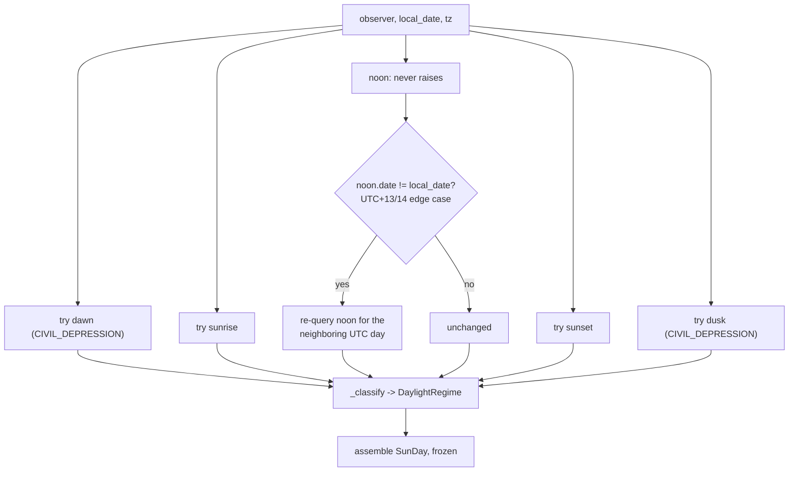
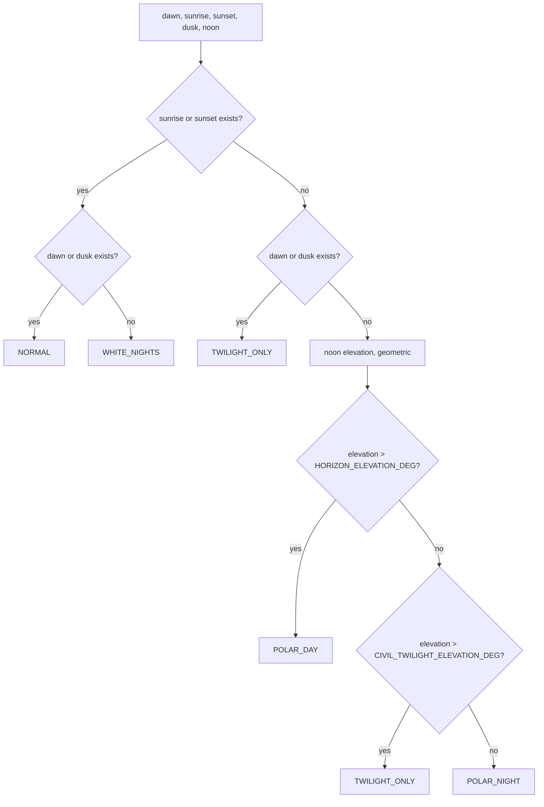

# Sun — Flow

**About:** [description](../__about/sun.md)

## Algorithm — `compute_sun_day`

## Algorithm — `_classify` (the regime decision tree)

Pseudocode (language-neutral):

    FUNCTION compute_sun_day(observer, local_date, tz):
        dawn    = try astral.sun.dawn(depression=CIVIL_DEPRESSION), None on ValueError
        sunrise = try astral.sun.sunrise, None on ValueError
        noon    = astral.sun.noon(observer, local_date, tz)          # never raises
        IF noon.date != local_date:
            noon = astral.sun.noon(observer, local_date shifted by ±1 day, tz)
        sunset  = try astral.sun.sunset, None on ValueError
        dusk    = try astral.sun.dusk(depression=CIVIL_DEPRESSION), None on ValueError
        RETURN SunDay(dawn, sunrise, noon, sunset, dusk,
                       regime=_classify(observer, noon, dawn, sunrise, sunset, dusk))

    FUNCTION _classify(observer, noon, dawn, sunrise, sunset, dusk):
        IF sunrise is not None OR sunset is not None:
            RETURN NORMAL IF (dawn is not None OR dusk is not None) ELSE WHITE_NIGHTS
        IF dawn is not None OR dusk is not None:
            RETURN TWILIGHT_ONLY
        elevation = astral.sun.elevation(observer, noon, with_refraction=False)
        IF elevation > HORIZON_ELEVATION_DEG:        RETURN POLAR_DAY
        IF elevation > CIVIL_TWILIGHT_ELEVATION_DEG:  RETURN TWILIGHT_ONLY
        RETURN POLAR_NIGHT
