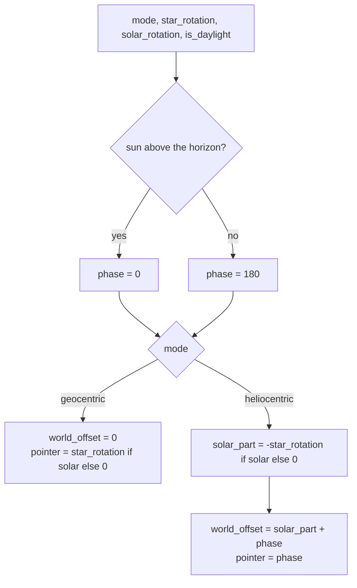

# World — Flow

**About:** [description](../__about/world.md)

## Algorithm

Two numbers per paint. The mode decides which of them carries the solar
offset, and the phase — the sun's own state — decides whether both take
the half-turn.

Pseudocode (language-neutral):

    FUNCTION night_phase_deg(is_daylight):
        RETURN 0 IF is_daylight ELSE WORLD_NIGHT_PHASE_DEG      # 180

    FUNCTION solar_part_deg(star_rotation, solar_rotation):
        RETURN -star_rotation IF solar_rotation ELSE 0

    FUNCTION world_offset_deg(mode, star_rotation, solar_rotation, phase):
        IF mode == "geocentric":
            RETURN 0
        RETURN (solar_part_deg(star_rotation, solar_rotation) + phase) MOD 360

    FUNCTION pointer_rotation_deg(mode, star_rotation, solar_rotation, phase):
        IF mode == "geocentric":
            RETURN star_rotation IF solar_rotation ELSE 0
        RETURN phase MOD 360

    FUNCTION flip_eased(p):
        p = clamp(p, 0, 1)
        RETURN p * p * (3 - 2 * p)                 # smoothstep

    FUNCTION flip_phase_deg(start, target, elapsed, duration):
        IF duration <= 0 OR elapsed >= duration:
            RETURN target
        IF elapsed <= 0:
            RETURN start
        RETURN start + (target - start) * flip_eased(elapsed / duration)

## Worked example — Belgrade, the ledger's own two days

`star_rotation_deg` answers **−4.17°** on the winter day (solar noon
EARLIER than 12:00) and **+10.76°** on the DST day (solar noon later).
In HELIOCENTRIC with Solar Rotation ON and the sun up:

    winter:  world_offset = -(-4.17) + 0 = +4.17    # band turns clockwise
    DST:     world_offset = -(+10.76) + 0 = -10.76  # band turns counter-clockwise

and the numeral of hour 12, whose own seat is `(12 - 12) * 15 = 0`,
therefore lands at `0 + world_offset`, i.e. **exactly the dial angle at
which true solar noon stands, negated** — noon at the top, which is the
whole point of the mode. At night the same two become `+184.17` and
`+169.24`, and the numeral of hour 0 (seat `−180`) takes the top instead.
