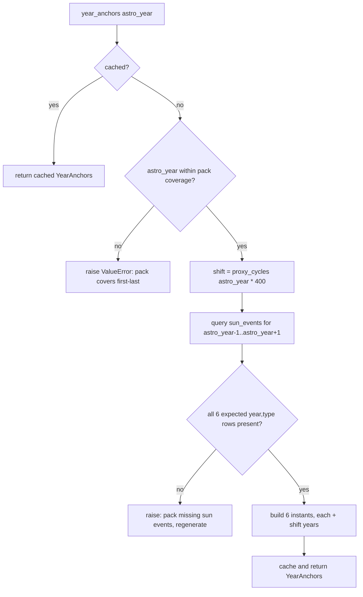

# Deep Time Repository — Flow

**About:** [description](../__about/deep_time.md)

## Algorithm — proxy-shifted year lookup (`year_anchors` / `moon_window`)

Pseudocode (language-neutral):

    FUNCTION year_anchors(astro_year):
        IF astro_year in cache: RETURN cache[astro_year]
        IF astro_year not within (coverage_first, coverage_last): raise
        shift = proxy_cycles(astro_year) * 400          # whole Gregorian cycles
        rows = SELECT year, month, day, sod, type FROM sun_events
               WHERE year BETWEEN astro_year-1 AND astro_year+1
        expected = [(year-1, DEC), (year, MAR), (year, JUN),
                    (year, SEP), (year, DEC), (year+1, MAR)]
        IF any expected key missing from rows: raise (regenerate pack)
        anchors = [instant(rows[key], shift) FOR key IN expected]
        cache[astro_year] = YearAnchors(year = astro_year + shift, instants = anchors)
        RETURN cache[astro_year]

`moon_window` follows the same shape: query `moon_events` for the same
3-year span, ordered by (year, month, day, sod); each row becomes
`(proxy instant, crossing_degree / 360)`.

## Algorithm — `eclipses_near(now, cycles)`: bracket without a table scan

    FUNCTION eclipses_near(now, cycles):
        jd = julian_day_of(now, cycles)          # un-shift now to the real astronomical JD
        shift = cycles * 400
        events = []
        FOR kind IN (solar, lunar):
            FOR eclipse IN (eclipse_before(jd, kind), eclipse_after(jd, kind)):
                IF eclipse is not None:
                    events.append(eclipse re-shifted by +shift years into now's own proxy frame)
        RETURN events    # up to 4 EclipseEvent, two indexed lookups per kind

`eclipse_before`/`eclipse_after` are each a single indexed
`ORDER BY jd_ut ... LIMIT 1` query — the only database I/O the eclipse
display costs per day-context rebuild.
