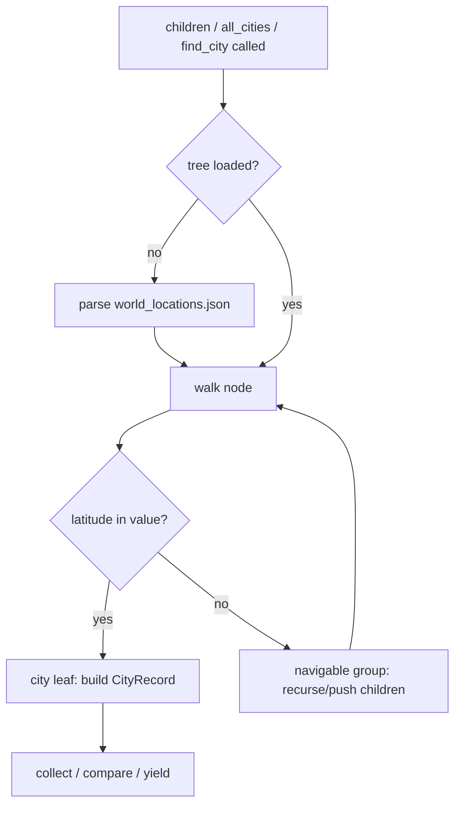

# Location Repository — Flow

**About:** [description](../__about/locations.md)

## Algorithm — shape-classified tree walk

Pseudocode (language-neutral):

    FUNCTION children(node_path):
        ensure tree is loaded
        node = tree
        FOR EACH segment IN node_path:
            IF segment not in node → raise KeyError(segment, depth, node_path)
            node = node[segment]
        RETURN [
            LocationNode(name, is_city_leaf(value) ? make_record(...) : None)
            FOR name, value IN node.items()
        ]

    FUNCTION all_cities() / find_city(name):
        stack = [(root_path, tree)]
        WHILE stack not empty:
            path, node = stack.pop()
            FOR child_name, value IN node.items():
                IF "latitude" IN value:               # city leaf, classified by SHAPE not depth
                    IF find_city: compare fold_name(child_name) to fold_name(wanted)
                    ELSE: collect (fold_name, display_name, path)
                ELSE:
                    stack.push((path + child_name, value))   # navigable group, any depth

## Search folding

    FUNCTION fold_name(text):
        decomposed = NFKD(text)                       # separates base letter from diacritic mark
        stripped   = remove combining marks
        lowered    = casefold(stripped)
        RETURN each char mapped through CITY_NAME_TRANSLITERATIONS if present, else unchanged

NFKD handles composable diacritics (š → s); the transliteration table
covers single-codepoint letters NFKD cannot decompose (ø, đ, ł).
