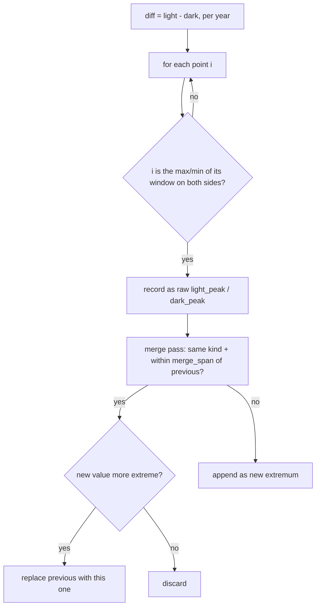

# Observatory Data — Flow

**About:** [description](../__about/observatory.md)

## Algorithm — `light_dark_extrema()`: windowed peak/trough detection

A bare immediate-neighbor comparison over the bin-mean series flags the
decimation's own rounding noise as dozens of spurious extrema clustered
around every true peak. A candidate must instead be the most extreme
point within a window on both sides, and near-duplicate survivors from
a flat plateau are merged to the single most extreme point.

Pseudocode (language-neutral):

    diff[i] = round(light[i] - dark[i], 4)
    window_bins = max(1, round(EXTREMA_WINDOW_YEARS / bin_width))

    raw = []
    FOR i IN 0..n-1:
        lo, hi = clamp(i - window_bins, 0), clamp(i + window_bins, n-1)
        neighborhood = diff[lo..hi]
        IF diff[i] >= max(neighborhood) AND diff[i] > diff[lo] AND diff[i] > diff[hi]:
            raw.append((years[i], diff[i], "light_peak"))
        ELIF diff[i] <= min(neighborhood) AND diff[i] < diff[lo] AND diff[i] < diff[hi]:
            raw.append((years[i], diff[i], "dark_peak"))

    merge_span = 2 * window_bins * bin_width
    merged = []
    FOR (year, value, kind) IN raw:
        IF merged not empty AND merged[-1].kind == kind AND year - merged[-1].year <= merge_span:
            IF this candidate is MORE extreme than merged[-1] → replace it
            ELSE → drop it
        ELSE:
            merged.append((year, value, kind))
    RETURN merged
