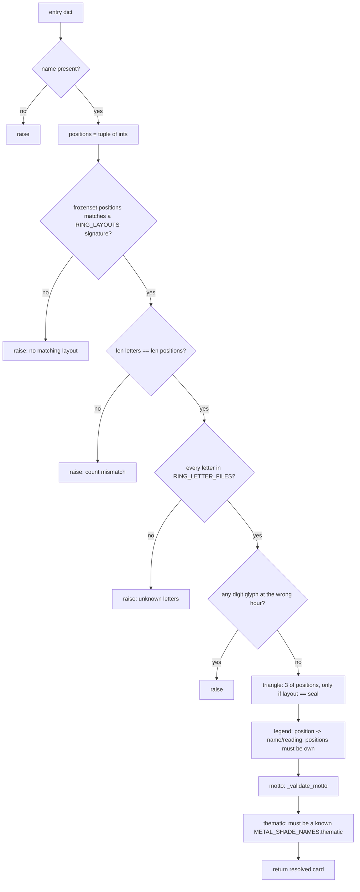
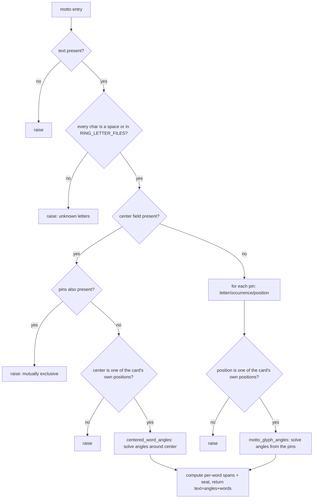

# Ring Presets — Flow

**About:** [description](../__about/rings.md)

## Algorithm — `validate_preset()`: card to resolved layout

Pseudocode (language-neutral):

    FUNCTION validate_preset(entry):
        name = entry.name.strip(); IF empty → raise
        positions = tuple(int(p) FOR p IN entry.positions)
        layout = RING_LAYOUTS entry whose position-set == frozenset(positions)
        IF no match → raise (list the known layouts)
        letters = tuple(str(l) FOR l IN entry.letters)
        IF len(letters) != len(positions) → raise
        IF any letter not in RING_LETTER_FILES → raise
        FOR position, glyph IN zip(positions, letters):
            IF glyph is a digit AND digit != position → raise   # a number only fits its own hour
        triangle = entry.triangle validated as 3-of-positions, ONLY IF layout == "seal"
        legend   = entry.legend validated position-by-position (name + reading required)
        motto    = _validate_motto(name, entry.motto or [], positions)
        thematic = entry.thematic validated against METAL_SHADE_NAMES["thematic"]
        RETURN {name, positions, letters, layout, triangle, legend, motto, thematic}

## Algorithm — `_validate_motto()`: two mutually exclusive entry forms

Each `motto` list entry is either a PINNED Great Seal form (`{text,
pins, clockwise}`) or a CENTERED cross-words form (`{text, center,
clockwise}`) — never both.

Pseudocode (language-neutral):

    FUNCTION _validate_motto(name, raw_entries, positions):
        resolved = []
        FOR EACH entry IN raw_entries:
            text = entry.text; IF empty → raise
            IF any char (not space) not in RING_LETTER_FILES → raise
            clockwise = entry.clockwise, default true
            IF entry.center is not None:
                IF entry.pins present → raise (mutually exclusive)
                IF center not in positions → raise
                angles = centered_word_angles(text, center, clockwise)
                words = one word, seat = center
            ELSE:
                FOR EACH (letter, occurrence, position) IN entry.pins:
                    IF position not in positions → raise
                angles = motto_glyph_angles(text, pins, clockwise)
                words = per-word spans; a word's seat = the ONE pin landing inside it (else none)
            resolved.append({text, angles, words})
        RETURN tuple(resolved)
