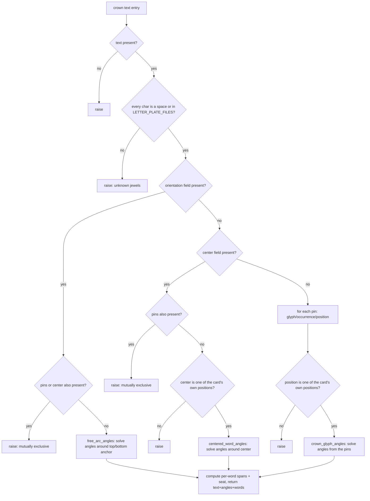

# Ring Presets — Flow

**About:** [description](../__about/rings.md)

## Algorithm — `validate_preset()`: card to resolved outer (THE COMPOSITIONAL RING MODEL, owner decree 2026-08-05)

```mermaid
flowchart TB
    A[entry dict] --> B{name present?}
    B -- no --> X1[raise]
    B -- yes --> C{outer is a known RING_OUTERS key?}
    C -- no --> X2[raise: unknown outer]
    C -- yes --> C2{name locked to a different outer in RING_OUTER_LOCK?}
    C2 -- yes --> X2b[raise: preset is locked]
    C2 -- no --> D[positions = RING_OUTERS.outer.positions]
    D --> E{len jewels == len positions?}
    E -- no --> X3[raise: count mismatch]
    E -- yes --> F{every jewel in LETTER_PLATE_FILES?}
    F -- no --> X4[raise: unknown jewels]
    F -- yes --> G{any digit glyph at the wrong hour?}
    G -- yes --> X5[raise]
    G -- no --> H[triangle: 3 of positions, only if outer == "hexa"]
    H --> I[legend: position -> name/reading, positions must be own]
    I --> J[crown_text: _validate_crown_text]
    J --> K[thematic: must be a known METAL_SHADE_NAMES.thematic]
    K --> L[return resolved card]
```

Pseudocode (language-neutral):

    FUNCTION validate_preset(entry):
        name = entry.name.strip(); IF empty → raise
        outer = entry.outer; IF not in RING_OUTERS → raise
        IF RING_OUTER_LOCK has name AND RING_OUTER_LOCK[name] != outer → raise
        positions = RING_OUTERS[outer].positions
        jewels = tuple(str(j) FOR j IN entry.jewels OR entry.letters)
        IF len(jewels) != len(positions) → raise
        IF any jewel not in LETTER_PLATE_FILES → raise
        FOR position, glyph IN zip(positions, jewels):
            IF glyph is a digit AND digit != position → raise   # a number only fits its own hour
        triangle = entry.triangle validated as 3-of-positions, ONLY IF outer == "hexa"
        legend     = entry.legend validated position-by-position (name + reading required)
        crown_text = _validate_crown_text(name, entry.crown_text or [], positions)
        thematic   = entry.thematic validated against METAL_SHADE_NAMES["thematic"]
        RETURN {name, positions, jewels, outer, triangle, legend, crown_text, thematic}

## Algorithm — `_validate_crown_text()`: three mutually exclusive entry forms

Each `crown_text` list entry is a PINNED Great Seal form (`{text, pins,
clockwise}`), a CENTERED cross-words form (`{text, center,
clockwise}`), or a free-form CROWN TEXT form (`{text, orientation}`,
owner decree 2026-08-05, custom rings only) — never more than one.



Pseudocode (language-neutral):

    FUNCTION _validate_crown_text(name, raw_entries, positions):
        resolved = []
        FOR EACH entry IN raw_entries:
            text = entry.text; IF empty → raise
            IF any char (not space) not in LETTER_PLATE_FILES → raise
            clockwise = entry.clockwise, default true
            IF entry.orientation is not None:
                IF entry.pins or entry.center present → raise (mutually exclusive)
                angles = free_arc_angles(text, orientation)   # "top" or "bottom" anchor
                words = one word, seat = None (not tied to any ring seat)
            ELIF entry.center is not None:
                IF entry.pins present → raise (mutually exclusive)
                IF center not in positions → raise
                angles = centered_word_angles(text, center, clockwise)
                words = one word, seat = center
            ELSE:
                FOR EACH (glyph, occurrence, position) IN entry.pins:
                    IF position not in positions → raise
                angles = crown_glyph_angles(text, pins, clockwise)
                words = per-word spans; a word's seat = the ONE pin landing inside it (else none)
            resolved.append({text, angles, words})
        RETURN tuple(resolved)
