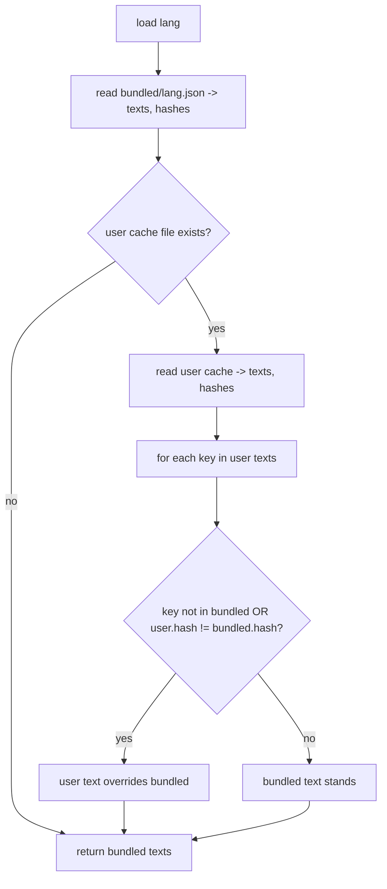

# Translations — Flow

**About:** [description](../__about/translations.md)

## Algorithm — hash-tracked cache resolution (`TranslationStore.load`)

Pseudocode (language-neutral):

    FUNCTION load(lang):
        bundled = read Database/translations/{lang}.json  (or empty)
        texts = copy(bundled.texts)
        IF user cache file exists:
            user = read <settings>/translations/{lang}.json
            FOR EACH key, text IN user.texts:
                IF key not in texts OR user.hashes[key] != bundled.hashes[key]:
                    texts[key] = text        # user's entry is newer than the bundle
        RETURN texts

    FUNCTION missing(lang, corpus):
        bundled_hashes = read bundled hashes (or empty)
        user_hashes = read user cache hashes (or empty)
        RETURN { key: text FOR key, text IN corpus
                 IF sha1(text) NOT IN {bundled_hashes[key], user_hashes[key]} }

## `collect_corpus()` — the key-naming walk

    corpus = {}
    FOR EACH article_set, body, article IN symbolism.json["articles"]:
        corpus["articles/{set}/{body}/base"] = article.base
        FOR EACH combo, text IN article.variants: corpus["articles/{set}/{body}/variants/{combo}"] = text
        FOR EACH face, text IN article.faces:     corpus["articles/{set}/{body}/faces/{face}"] = text
    FOR EACH group IN (zodiac_articles, chinese_articles, chinese_elements, trio_articles):
        FOR EACH name, article IN symbolism.json[group]: same base/variants walk under "{group}/{name}/..."
    IF encyclopedia.json exists:
        FOR EACH section IN (instrument, week, seasons, sun, moon, era, eclipse, theme_title, week_duality):
            FOR EACH key, node IN encyclopedia.json[section]:
                corpus["encyclopedia/{section}/{key}/title"] = node.title
                corpus["encyclopedia/{section}/{key}/base"]  = node.base
        FOR EACH family IN (virtues, sins, moods, duality, ninths, wider, intelligence, months,
                             cube, double_trinity, crosses, one_soul):
            FOR EACH name, node IN encyclopedia.json[family]:
                corpus["encyclopedia/{family}/{name}/base"] = node.base
    IF guide captions.json exists: corpus["guide/{stem}"] = text, for each caption
    IF guide pages.json exists:    corpus["guide_page/{index}"] = page.title, for each page
    FOR EACH text IN ui_text.UI_STRINGS: corpus["ui/{text}"] = text     # the English string IS the key
    RETURN corpus
