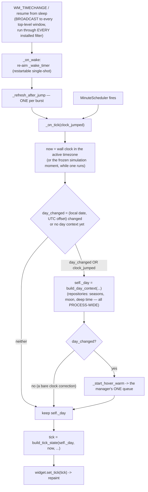
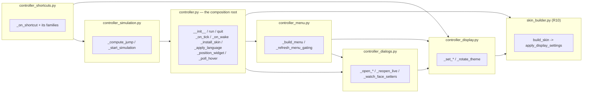

# Watch Controller — Flow

**About:** [description](../__about/controller.md)

## Algorithm — tick flow

Unreadable or out-of-coverage astronomical data raises OUT of
`build_day_context` — the controller shows a visible dialog and exits
rather than let the dial silently render something wrong.

**The two seams marked above are the 2026-08-06 fix.** A clock jump
rebuilds the day CONTEXT (it may have crossed midnight, a zone or a
travel target) but never starts the hover sweep — an NTP correction of a
few seconds speaks no new article, and the sweep is 7,201 pure-Python
probes measured at 58.2 s. And because Windows broadcasts the message to
every window while Qt runs it through every installed filter, N watches
saw one SYNC as N² wakes until the coalescer collapsed the burst.

## What moved out (WA-R14, 2026-08-19)
The menu tree is [Controller Menu — Flow](controller_menu.md); the jump
arithmetic and the flowing simulated moment are
[Controller Simulation — Flow](controller_simulation.md). What is drawn
here is what the composition root itself still runs.

## Responsibility map — one class, six modules

All five are MIXINS of `WatchController`, so every arrow above is a
plain `self.` call — no back-channels, and no call site changed when
they were cut out.
