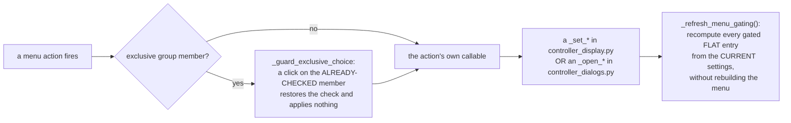

# Controller Menu — Flow

**About:** [description](../__about/controller_menu.md)

## Layout — the right-click / tray menu (`_build_menu`)

```mermaid
%%{init: {'flowchart': {'subGraphTitleMargin': {'top': 0, 'bottom': 35}}}}%%
flowchart TB
    subgraph MENU["_StayOpenMenu — shared by tray popup and dial right-click"]
        TITLE["TITLE row (location, or the full name form with 2+ watches)"]
        ADD["Add Watch"]
        REM["Remove this Watch (watches 2+ only)"]
        SHOW["Show (tray-only — hidden on the dial's own popup)"]
        FACE["Watch Face..."]
        VIS["Visible (dropdown: Pointer/Colorful/Earth/Moon/Seconds)"]
        NAMES["Names (weekday names + archetype names)"]
        TOGGLES["Legend   Solar rotation   Archetype   Click-through"]
        DIALOGS["Settings...   Encyclopedia...   Observatory...
        Guide...   Time Travel..."]
        REPORT["Report (hidden until the secret code unlocks it)"]
        EXIT["Exit"]
    end
    TITLE --> ADD --> REM --> SHOW --> FACE --> VIS --> NAMES --> TOGGLES --> DIALOGS --> REPORT --> EXIT
```

Every level is a `_StayOpenMenu` — checkable picks (and actions tagged
`"stay_open"`) keep it open so several settings can change in one visit.

## Algorithm — where an entry's click goes

The menu is built ONCE (`__init__`) and handed to both the widget and
the tray. Nothing here rebuilds it on a settings change — the stay-open
menu would lose its window; only the gray states and the checks move.
