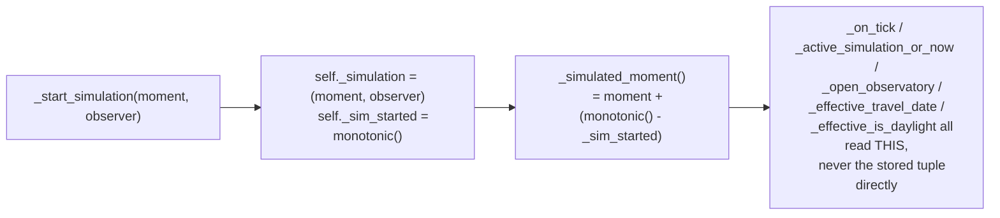

# Controller Simulation — Flow

**About:** [description](../__about/controller_simulation.md)

## Algorithm — `_compute_jump` (the shared travel arithmetic)

```mermaid
%%{init: {'flowchart': {'subGraphTitleMargin': {'top': 0, 'bottom': 35}}}}%%
flowchart TB
    A["_compute_jump(moment, observer, cycles, kind, city)"] --> B{kind matches
    _SUN_MOON_JUMP_PATTERN?}
    B -- yes --> C["_filtered_sun_anchors / _filtered_moon_events:
    the year's turning points, narrowed by the optional
    phase filter (solstice/equinox/new/full/quarter)"]
    B -- no --> D{kind is a place (pole/Greenwich/city)?}
    D -- yes --> E["real coordinates, real local clock"]
    D -- no --> F{kind in _UNIT_JUMPS
    (day/month/year/century/millennium)?}
    F -- yes --> G["shift_calendar(moment, unit)"]
    F -- no --> F2{kind matches
    _ECLIPSE_JUMP_PATTERN?
    (next/prev, solar/lunar,
    optional TYPE suffix)}
    F2 -- yes --> G2["deep.eclipse_after/before(jd, kind, type_)
    type_ narrows to one catalog type
    (owner selector spec 2026-08-11)"]
    F2 -- no --> F3{kind in _TIME_JUMPS?
    (hour/minute/second)}
    F3 -- yes --> G3["base_moment + sign * timedelta(unit)
    NO minute-flooring — returned early"]
    C --> H
    E --> H
    G --> H{landing found?}
    G2 --> H
    H -- no --> I[(None — edge clamp, no-op)]
    H -- yes --> J["deep-travel events rebased into the
    caller's proxy frame via julian_day_of"]
    J --> K["re-canonicalize into the 400-year proxy
    (canonical_proxy) before returning"]
    K --> L[("moment, observer, cycles")]
    G3 --> L
```

Three callers wrap this pure function: `_apply_jump` (keyboard
shortcuts — starts/refreshes the live simulation directly),
`_dialog_jump` (the Time Travel dialog's Quick Jump rows — starts the
live simulation AND returns the landing for the dialog to mirror onto
its own fields), and the Time Travel dialog's own OK button (via
`TimeTravelDialog.moment()`/`.cycles()`, read directly rather than
through `_compute_jump`).

## The flowing simulated moment (owner spec 2026-08-11)



The landed moment is not a frozen frame for the rest of
`TIME_TRAVEL_DURATION_S` — every second of real wall-clock time that
passes advances the displayed moment by the same second, so a traveled
dial keeps running (day into night, an eclipse closing) instead of
holding still. `_end_simulation` returns to the present and restores the
live location display.
