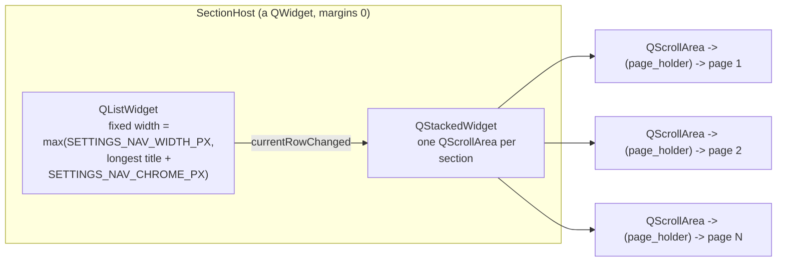
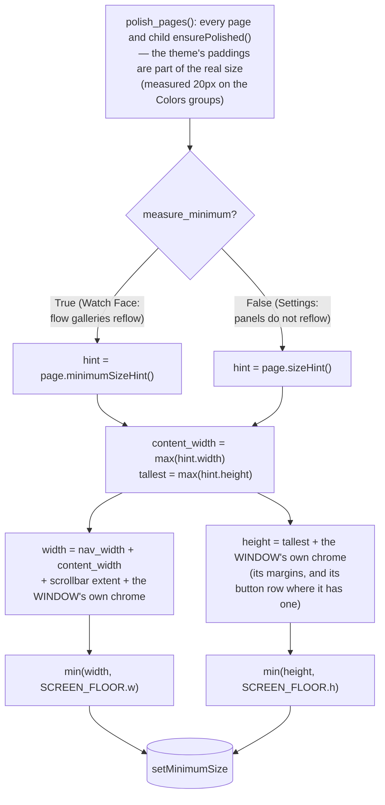
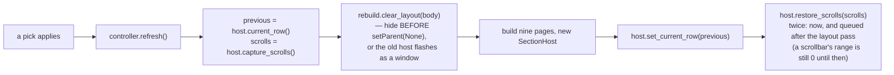

# Section Host — Flow

**About:** [description](../__about/section_host.md)

## Layout — what the host builds

The window hands in `(label, page)` pairs. It never hands in a builder:
the pages are built by whoever owns their state, so nothing has to be
passed out of the host and back again.

## Algorithm — the declared minimum

The floor is THE SPACE & LEGIBILITY LAW's ladder step 4: past it the
pages scroll, because the window is genuinely full. The host answers for
the sidebar, the widest page and the scrollbar — the three numbers both
windows had written out identically; each window still adds the chrome
only it knows about.

## The live-pick rebuild (Watch Face only)

A pick may change the WATCH and nothing else — never the section, never
the scroll, never the focused side of the window (owner decree
2026-08-10).
