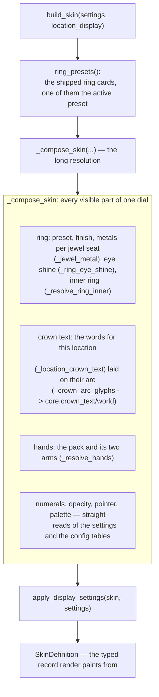

# Skin Builder — Flow

**About:** [description](../__about/skin_builder.md)

## Algorithm — `build_skin(settings, location_display)`

The build is PURE: same settings and location in, same record out. No
`self`, no window, no wall clock — which is why 28 test files can call
it directly and assert on the result.

## Algorithm — the display OVERLAY

`build_skin` answers "what IS this dial". `apply_display_settings`
answers "what does it SHOW right now" — the picks that change content
without rebuilding structure, so a checkbox does not pay for a whole
recompose.

    FUNCTION apply_display_settings(skin, settings):
        display = display_for(settings)          # the plain reads
        RETURN _overlay_display_settings(skin, settings, display)

    FUNCTION _overlay_display_settings(skin, settings, display):
        weekday_mode = effective_weekday_slot(settings)   # slot 1's real mode
        FOR each slot:
            mode  = the slot's own content pick
            theme = _classic_slot_theme(...) when it shows weekday bodies
            metal = _theme_metal(settings, theme)
            bodies = _themed_weekday_set(...) or _pantheon_weekday_set(...)
        seconds = slot_seconds(settings)         # does any slot tick?
        RETURN the skin with those parts replaced

`effective_weekday_slot` and `slot_seconds` are PUBLIC because the
controller asks the same two questions — one for menu gating, one to
decide whether the tick needs a second hand.

## Where the rest of the old file went

This module is R10 of the [OOP
audit](../../../docs/AUDIT-OOP-2026-08-18.md): the skin composition
lifted out of `app/controller.py` whole. The responsibilities that
stayed behind are mapped in [Watch Controller —
Flow](controller.md#responsibility-map).
