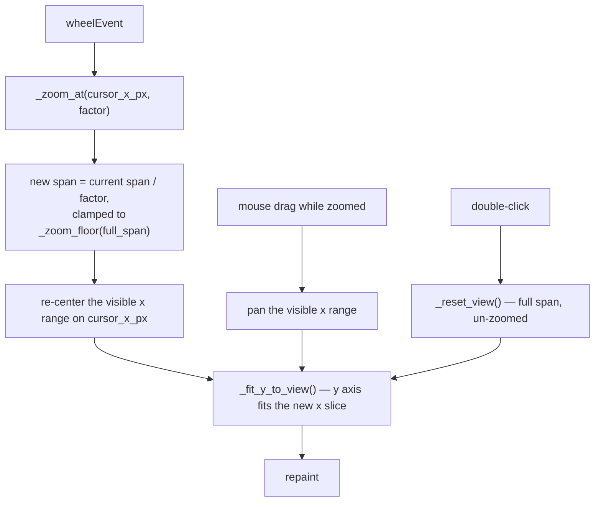

# Charts — Flow

**About:** [description](../__about/charts.md)

## Algorithm — zoom / pan (`ChartBase`)

`_zoom_floor(full_span)` is the overridable seam: `LineChart` floors at
the median gap between consecutive x samples of its first visible
series (so a decimated 20-year-stride bundle cannot be zoomed to a
misleading 1-year view of interpolated points); `EclipseChart` floors
at the median gap between eclipse years, or the density bucket width.
