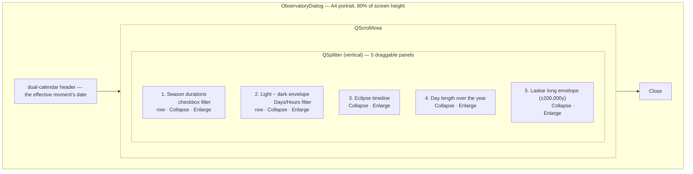
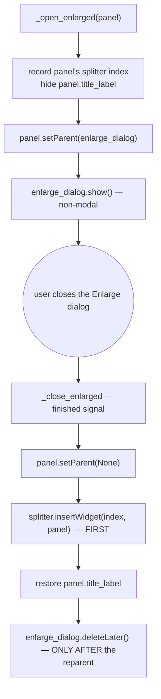

# Dialog — Flow

**About:** [description](../__about/dialog.md)

## Layout

Each panel's chart is one `ChartBase` subclass instance; "Enlarge"
reparents that SAME instance into a separate `EnlargeDialog` (16:9 at
50% of screen height) and back on close.

## Algorithm — Enlarge / close cycle (the fixed crash)

The crash this pins: `EnlargeDialog` must NOT carry
`WA_DeleteOnClose` — that flag queues the dialog's own C++ destruction,
and since `panel` was a real Qt child of it, the queued deletion could
destroy `panel` before step H ran. Reparenting back BEFORE the explicit
`deleteLater()` call is what makes the order safe.
