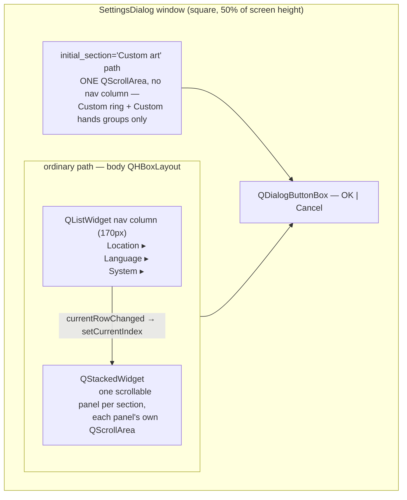

# Settings Dialog — Flow

**About:** [description](../__about/dialog.md)

## Layout

Each ordinary panel hosts that section's group boxes — built by the three
mixins (see the [folder doc](../___settings_dialog.md)'s layout table for
which groups belong to which section). Phase 6 FINAL cleanup retired the
Display/Colors/Themes sections (their content lives LIVE-APPLY in the Watch
Face window instead) and added the SEPARATE hidden path for Custom art.

## Lifecycle (pseudocode)

    ON open(settings, skin, overlay, initial_section):
        IF initial_section == "Custom art":
            build ONE page: Custom ring group + Custom hands group
            wrap it in a QScrollArea, no nav column (_nav_list/_stack stay None)
        ELSE:
            build 3 (title, [group_boxes]) sections from the 3 mixins
            FOR EACH section:
                add nav row "title ▸"
                wrap its groups in a scrollable panel, add to the stack
            wire nav.currentRowChanged -> stack.setCurrentIndex
            select nav row 0 (or initial_section's row, if named)
        size window: square at 50% of screen height,
                     width = max(content width, nav width + panel floor)
        seed self._place = settings.place            (the ONE location field)
        IF NOT custom-art-only AND settings.place.path exists:
            walk the combo cascade to that path      (presentation only —
                the cascade can no longer write the place back)
            show the place's timezone / latitude / longitude
            arm suggestion popups — only react to USER input from here on
            connect the coordinate spin boxes LAST, so seeding them above
                is never mistaken for a hand tune

    ON OK (accepted):
        result_settings():
            custom-art-only -> replace(settings, custom_rings=...) ONLY
            ordinary -> replace(settings, place=..., language=..., z_mode=..., ...)
                        every OTHER field (Watch-Face-owned) passes through
                        UNCHANGED, never read off a widget that no longer exists
        the caller (Watch Controller) applies the result

    ON done(result):                      # both OK and Cancel funnel here
        release the location repository's tree (harmless no-op in the
        custom-art-only mode too — the repository is always constructed)
        proceed with the normal QDialog close
