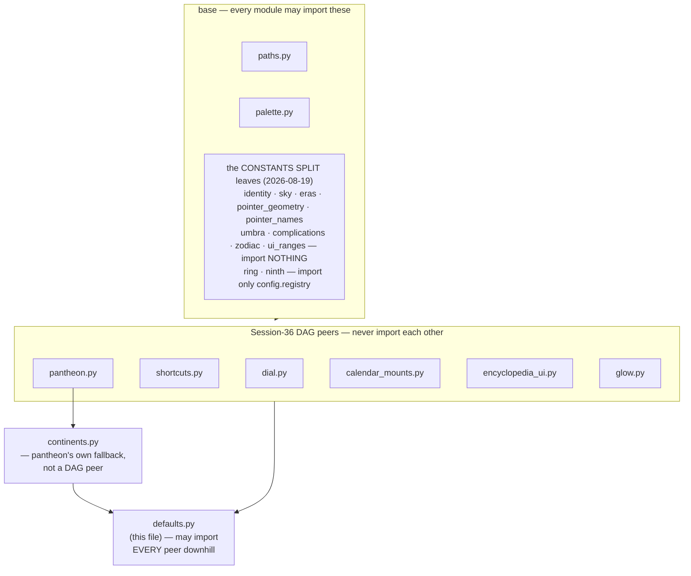
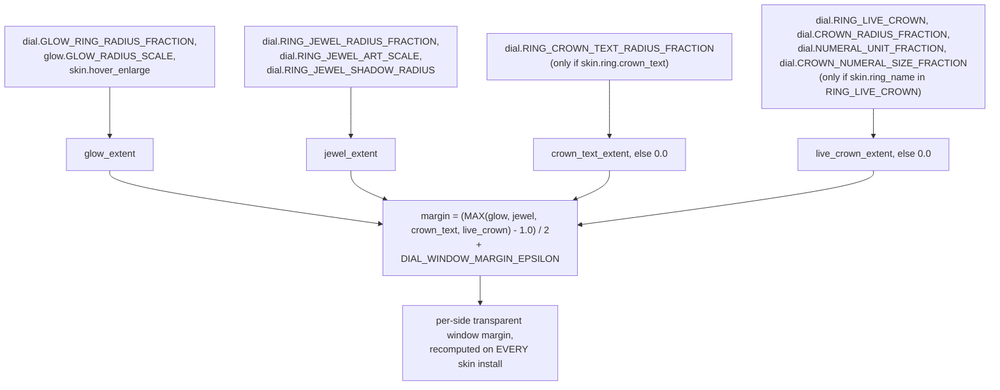

# Defaults — Flow

**About:** [description](../__about/defaults.md)

## Sections

```
📁 defaults.py  (812 lines, the Session-36 remnant)
  Coordinator value          ECLIPSE_SOLAR_ART (owner's OWN icon path,
                              2026-08-11 — no longer the Planets weekday dual)
  Cross-DAG remnants        ECLIPSE_LUNAR_TYPE_ICON,
                             ECLIPSE_SOLAR_TYPE_ICON_SOURCE
  Location                  DEFAULT_CITY
  Tick scheduling           TICK_EPSILON_MS, CLOCK_JUMP_THRESHOLD_S,
                             CLICK_THROUGH_HOVER_POLL_MS
  Settings persistence      SETTINGS_SCHEMA_VERSION, _WRITE_DEBOUNCE_MS
  Tray / app presentation   TRAY_ICON_SIZE, LOGO_ASSET, WINDOW_ICON_SIZES_PX
  UI icon chrome            ICON_DIR, ICON_FILES, icon_path()
  Working-set ceilings      WORKING_SET_CEILINGS
  Time Travel Quick Jumps   QUICK_JUMP_POLE_LATITUDE, GREENWICH_*
  Subdial recolor recipe    SUBDIAL_RECOLOR_VALUE_RAMP, _SAT_CUTOFF, _RIM_RADIUS
  Report                    REPORT_REFRESH_MS, REPORT_BAR_TOP_N
  The Observatory           OBSERVATORY_BUNDLE_*, _ZOOM_*, _ECLIPSE_KIND_INFO
  The Guide                 GUIDE_DIR, GUIDE_INITIAL_IMAGE_PX
  Dialog opening sizes      DIALOG_A4_*, DIALOG_SQUARE_HEIGHT_FRACTION
  Translation                TRANSLATE_ENDPOINT, TRANSLATE_TIMEOUT_S
  Window margin              dial_window_margin_fraction()
  Shared art content roots  ZODIAC_ART_DIR, EMBLEM_ART_DIRS, ERA_ART_DIR, ...
  THE METAL SHADES          METAL_SHADES (ramp mapping), METAL_SOURCE_*
  DEFAULT_SKIN               the one SkinDefinition (see below)
  Pole light/dark windows   POLE_LIGHT_WINDOW, pole_is_light()
```

## The import DAG this file sits atop



A value two peers both need cannot live in either peer (that would be
a cross-peer import, forbidden) and must not be duplicated (Rule #5) —
it lives in `defaults.py`, the one module allowed to import every peer.

## dial_window_margin_fraction — the flagship coordinator



`live_crown_extent` is the Crown Polish round's own fourth term (owner
correction 2026-08-06): The One and Templar carry NO `crown_text` card
entry (their live time is drawn by `render.layers.numerals.
LiveCrownLayer`, not a preset card field), so `crown_text_extent` stayed
0.0 for both and the window clipped the live glyphs at default size —
the SAME reach shape `crown_text_extent` uses
(`center_radius + full_height * (1 + 2·RING_JEWEL_SHADOW_RADIUS)`),
anchored at the live crown's own `CROWN_RADIUS_FRACTION`.

## DEFAULT_SKIN's own shape

```
SkinDefinition
  z_order: (background, star, weekday_set, ring, year_marker, hands)
  background: BackgroundSpec   (day/twilight alpha, umbra/aura radius)
  star:        StarSpec         (day/twilight alpha, border, radius)
  ring:        RingSpec          (placeholder face — build_skin ALWAYS
                                  overlays the chosen preset card)
  weekday_set: WeekdaySpec       (7 body art paths, ghost/center display)
  year_marker: YearMarkerSpec    (Earth variants x style x continent x
                                  phase, the Moon's own art/colors)
  hands:       HandsSpec         (placeholder — build_skin ALWAYS
                                  resolves the chosen hand pack)
```

`ring` and `hands` are documented placeholders — the controller's
`build_skin` always replaces them with the user's actual choice before
the first paint; only `background`/`star`/`weekday_set`/`year_marker`
ship their real, final values here.
