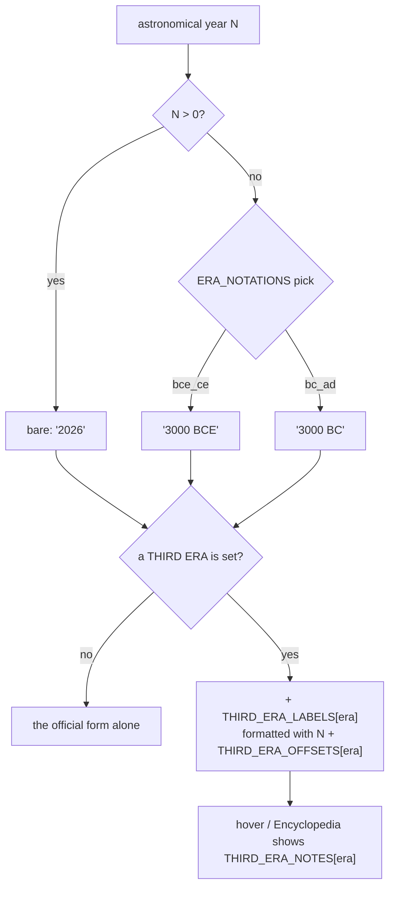

# Eras — Flow

**About:** [description](../__about/eras.md)

## Sections

```
📁 eras.py
  NOTATION         ERA_NOTATIONS, ERA_NOTATION_TITLES
  WHICH FORM       EARTH_LABEL_MODES, Z_MODES, Z_MODE_TITLES
  NAMED ERAS       ERA_NAMES, ANNO_LUCIS_OFFSET, ANNO_LUCIS_LABEL,
                   AGE_OF_LIGHT_START_YEAR, AGE_OF_LIGHT_END_YEAR
  THIRD CALENDARS  THIRD_ERAS ─┬─ THIRD_ERA_TITLES   (menu name)
                               ├─ THIRD_ERA_OFFSETS  (epoch shift)
                               ├─ THIRD_ERA_LABELS   (printed form)
                               └─ THIRD_ERA_NOTES    (Encyclopedia text)
                   MAYA_EPOCH_JDN, OLYMPIAD_EPOCH_YEAR,
                   GREGORIAN_CYCLE_YEARS, PROXY_WINDOW_FIRST
  THE PLACE        LATITUDE_RANGE, LONGITUDE_RANGE,
                   CITY_NAME_TRANSLITERATIONS
```

## Writing one year



Pseudocode:

    year_label(N, notation, third_era):
        official <- str(N) IF N > 0 ELSE f"{-N} {ERA_NOTATIONS[notation]}"
        IF third_era is None: RETURN official
        shifted <- N + THIRD_ERA_OFFSETS[third_era]
        RETURN official + " · " + THIRD_ERA_LABELS[third_era].format(shifted)

The four `THIRD_ERA_*` tables are keyed by the SAME `THIRD_ERAS` tuple,
so adding a calendar is four rows in four tables and nothing else — the
formatter above never grows a branch.
