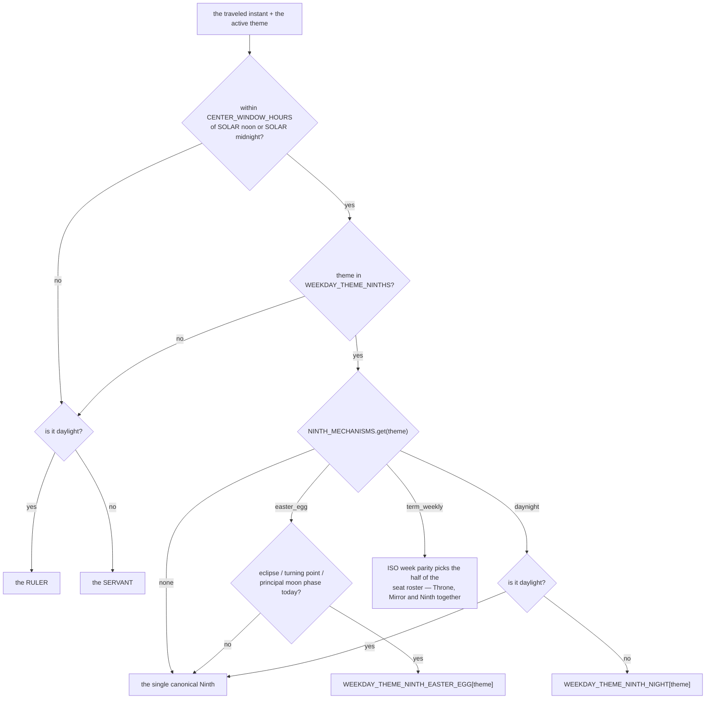

# Ninth — Flow

**About:** [description](../__about/ninth.md)

## Sections

```
📁 ninth.py
  THE TABLES     WEEKDAY_THEME_NINTHS        (theme → name, plate)
                 WEEKDAY_THEME_NINTH_EASTER_EGG   (the Pangea alt)
                 WEEKDAY_THEME_NINTH_NIGHT        (the Dyad's night alt)
  THE LAW        NINTH_MECHANISMS, NINTH_MECHANISM_KINDS
  THE WINDOW     CENTER_WINDOW_HOURS
```

## Which face the centre seat wears



Pseudocode:

    centre_face(tick, theme):
        IF hours_from_solar_anchor(tick) > CENTER_WINDOW_HOURS:
            RETURN ruler(theme) IF tick.is_daylight ELSE servant(theme)
        IF theme NOT IN WEEKDAY_THEME_NINTHS:
            RETURN ruler(theme) IF tick.is_daylight ELSE servant(theme)
        mechanism <- NINTH_MECHANISMS.get(theme)         # ∈ NINTH_MECHANISM_KINDS
        MATCH mechanism:
            None         -> WEEKDAY_THEME_NINTHS[theme]
            easter_egg   -> ALT IF sky_is_busy(tick) ELSE canonical
            daynight     -> canonical IF tick.is_daylight ELSE NIGHT[theme]
            term_weekly  -> roster_half(iso_week(tick) mod 2)

The anchors are SOLAR, never wall-clock: the window is measured from the
day's own `DayContext.sun.noon`, so a dial in a place with a shifted
zone still shows the Ninth at ITS noon.
`tests/test_ninth_mechanisms.py` fails the build if `NINTH_MECHANISMS`
ever names anything outside `NINTH_MECHANISM_KINDS`, or if a double
Ninth found in ANY registry has no entry here at all.
