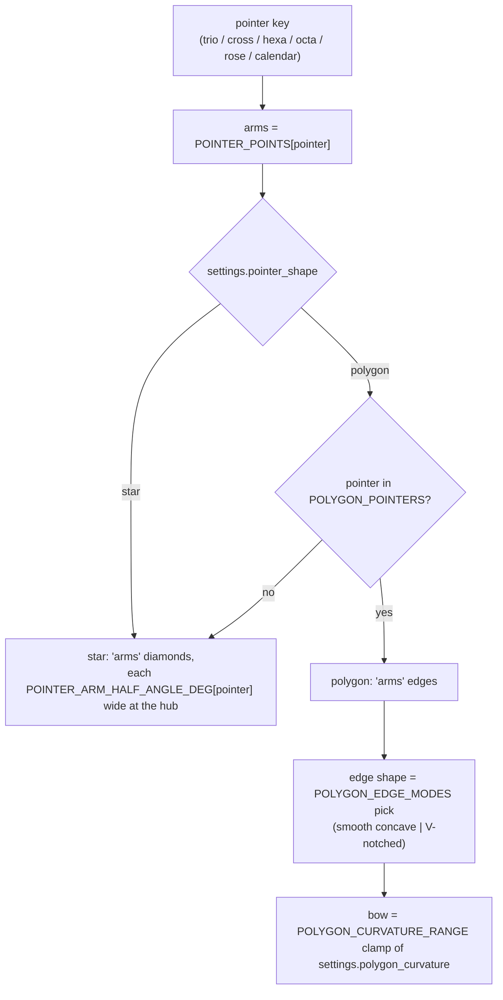

# Pointer Geometry — Flow

**About:** [description](../__about/pointer_geometry.md)

## Sections

```
📁 pointer_geometry.py
  ARM & WEDGE COUNTS   POINTER_POINTS, POINTER_DIAL_COUNTS,
                       CALENDAR_WEDGES, CALENDAR_WEDGE_DEG,
                       GREGORIAN_MONTH_NAMES
  ARM HALF-ANGLES      POINTER_ARM_HALF_ANGLE_DEG
  SHAPE & EDGES        POINTER_SHAPES, POINTER_SHAPE_DEFAULT,
                       POLYGON_POINTERS,
                       POLYGON_CURVATURE_RANGE / _DEFAULT,
                       POLYGON_EDGE_MODES / _DEFAULT
```

## Resolving one pointer's outline



Pseudocode:

    outline(pointer, settings):
        arms <- POINTER_POINTS[pointer]
        shape <- settings.pointer_shape
        IF shape == "polygon" AND pointer NOT IN POLYGON_POINTERS:
            shape <- POINTER_SHAPE_DEFAULT           # a half-available look is never offered
        IF shape == "star":
            RETURN star(arms, POINTER_ARM_HALF_ANGLE_DEG[pointer])
        RETURN polygon(arms,
                       clamp(settings.polygon_curvature, POLYGON_CURVATURE_RANGE),
                       settings.polygon_edge or POLYGON_EDGE_DEFAULT)

The calendar pointer is the one whose arms are WEDGES rather than
diamonds: `CALENDAR_WEDGES` (12) × `CALENDAR_WEDGE_DEG` (30°) is the full
circle, and `GREGORIAN_MONTH_NAMES` rides one wedge each.
