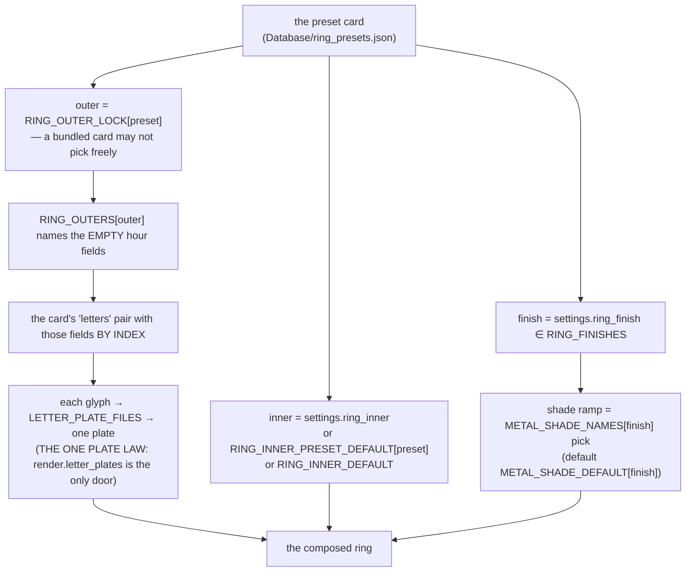

# Ring — Flow

**About:** [description](../__about/ring.md)

## Sections

```
📁 ring.py
  FINISHES & METALS   RING_FINISHES, RING_THEMATIC_SHADES,
                      METAL_SHADE_NAMES, METAL_SHADE_DEFAULT,
                      METAL_SHADE_TITLES
  SUBDIAL PLATES      SUBDIAL_STYLES, SUBDIAL_SETS,
                      SUBDIAL_SET_DEFAULT, SUBDIAL_SET_TITLES
  OUTERS/INNERS       RING_OUTERS ── RING_OUTER_LOCK (preset → its one outer)
                      RING_INNERS, RING_INNER_PRESET_DEFAULT,
                      RING_INNER_DEFAULT
                      RING_EYE_GLYPH, RING_EYE_SHINE_FILE / _DEFAULT /
                      _ENLARGE
  LETTERS             LETTER_PLATE_GROUPS ── LETTER_PLATE_FILES
                      (Greek twins, own plates, digits, ring numbers)
                      RING_CROWN_TEXT_CHARSET
  THEME METAL LOOKS   METAL_THEMES (from THE REGISTRY), THEME_METALS,
                      THEME_METALS_OVERRIDE, theme_metals()
```

## Composing one ring



Pseudocode:

    ring_metal_for(theme, settings):
        allowed <- theme_metals(theme)          # never THEME_METALS directly
        IF settings.theme_metal IN allowed: RETURN settings.theme_metal
        RETURN allowed[0]

    theme_metals(theme):
        RETURN THEME_METALS_OVERRIDE.get(theme, THEME_METALS)

`theme_metals()` exists because ONE theme (`planets_art`) has no
`colored/` art folder: a half-available look must never be offered, so
every call site that lists a theme's metals — the menu, the Settings
dialog, the settings validation and the tests — reads the gate rather
than the flat tuple.
