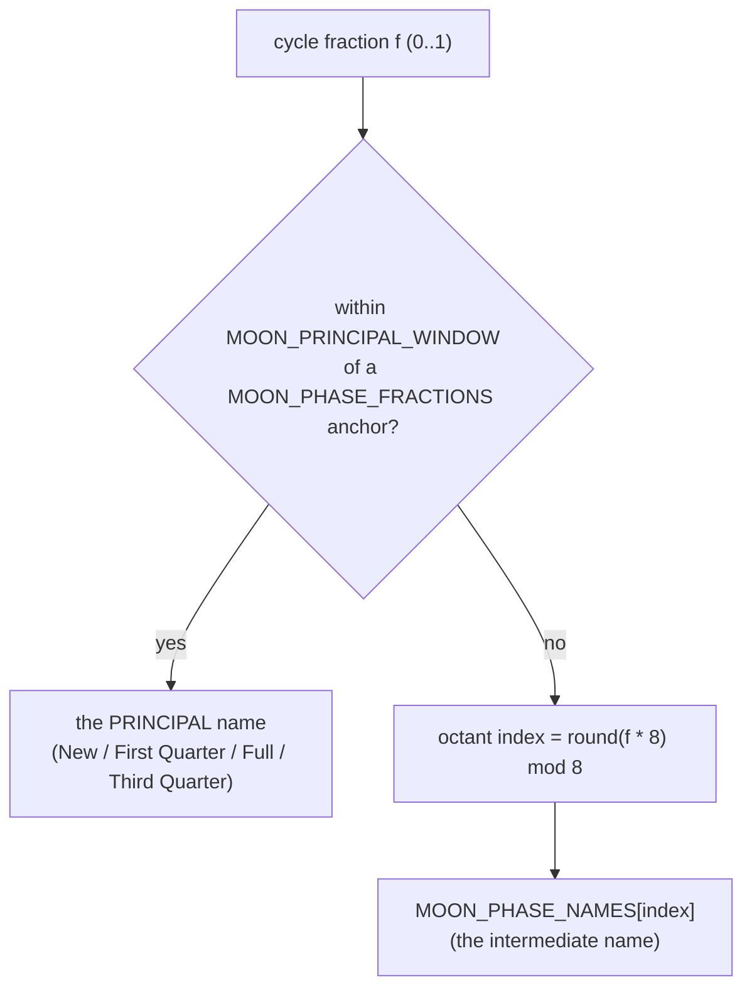
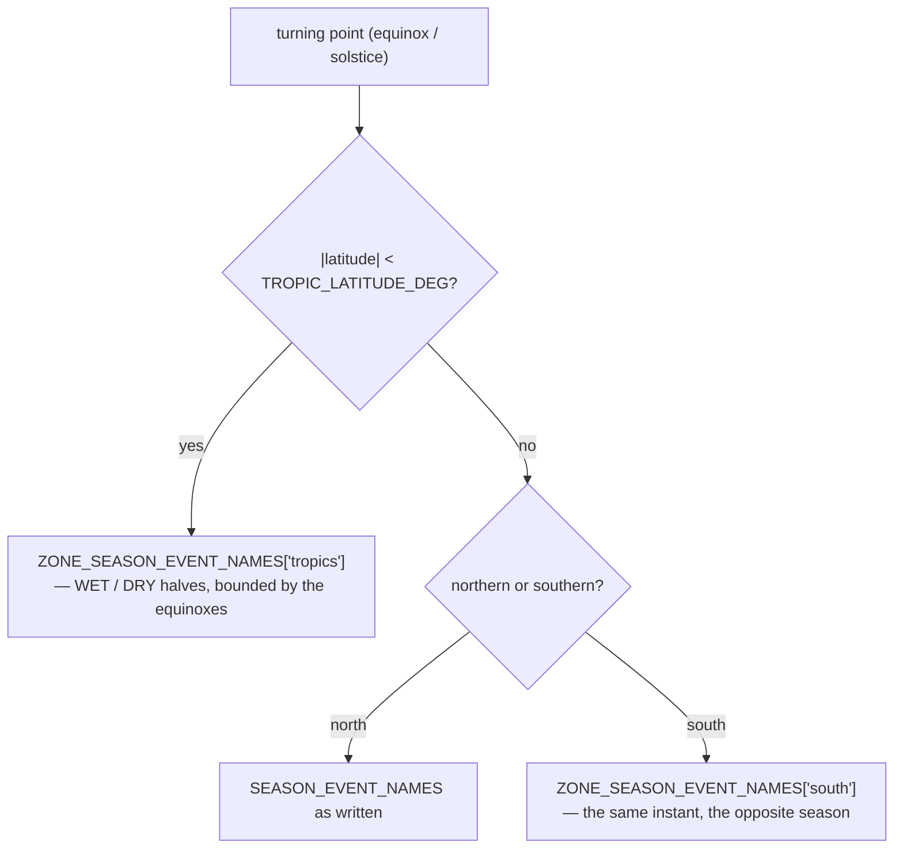

# Sky — Flow

**About:** [description](../__about/sky.md)

## Sections

```
📁 sky.py
  THE SUN         CIVIL_DEPRESSION, HORIZON_ELEVATION_DEG,
                  CIVIL_TWILIGHT_ELEVATION_DEG
  THE YEAR WHEEL  YEAR_ANCHOR_ANGLES  (6 unwrapped angles, one calendar year)
  THE MOON        SYNODIC_MONTH_DAYS, MOON_PRINCIPAL_WINDOW,
                  MOON_PHASE_NAMES (8), MOON_PHASE_FRACTIONS (4),
                  MOON_CYCLE_QUARTER
  DEEP TIME       DEEP_TIME_DB_FILENAME
  SEASON EVENTS   SEASON_EVENT_NAMES, ZONE_SEASON_EVENT_NAMES
  TROPICS         TROPIC_LATITUDE_DEG, TROPICAL_YEAR_DAYS
```

## Naming a moon phase from a cycle fraction



Pseudocode:

    phase_name(f):
        FOR name, anchor IN MOON_PHASE_FRACTIONS:
            IF cyclic_distance(f, anchor) <= MOON_PRINCIPAL_WINDOW:
                RETURN name
        RETURN MOON_PHASE_NAMES[round(f * 8) mod 8]

`MOON_PRINCIPAL_WINDOW` is half a DAY expressed as a cycle fraction
(`0.5 / SYNODIC_MONTH_DAYS`), which is why it is derived here rather
than written as a magic number: change the lunation length and the
window follows.

## Naming a season event where the observer stands



The year wheel reads the SAME instants through `YEAR_ANCHOR_ANGLES`: six
anchors, not four, because a year's arc needs the solstice BEFORE it and
the equinox AFTER it to interpolate the ends.
