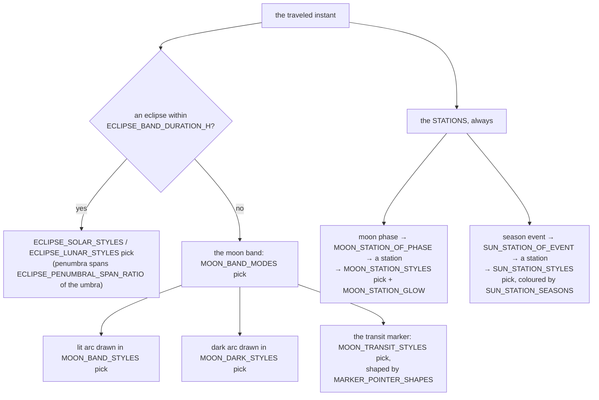

# Umbra — Flow

**About:** [description](../__about/umbra.md)

## Sections

```
📁 umbra.py
  THE BAND       UMBRA_FORMS, UMBRA_SECTION_COUNTS,
                 UMBRA_CONTRAST_VARIANTS, UMBRA_TINT_MODES,
                 AURA_OFF_TINT_MODES
  THE MOON       MOON_BAND_MODES / _DEFAULT, MOON_BAND_STYLES / _DEFAULT,
                 MOON_DARK_STYLES / _DEFAULT,
                 MOON_TRANSIT_STYLES / _DEFAULT,
                 MARKER_POINTER_SHAPES / _DEFAULT
  ECLIPSES       ECLIPSE_SOLAR_STYLES / _DEFAULT,
                 ECLIPSE_LUNAR_STYLES / _DEFAULT,
                 ECLIPSE_BAND_DURATION_H, ECLIPSE_PENUMBRAL_SPAN_RATIO
  STATIONS       MOON_STATION_STYLES / _DEFAULT, MOON_STATION_GLOW,
                 SUN_STATION_STYLES / _DEFAULT, SUN_STATION_SEASONS,
                 LIFE_STATIONS,
                 MOON_STATION_OF_PHASE, SUN_STATION_OF_EVENT
  THE MENU       MOVING_BODY_MENUS
```

## What the band shows at one instant



Pseudocode:

    umbra_faces(tick, settings):
        faces <- []
        IF tick.eclipse AND tick.eclipse.hours_away <= ECLIPSE_BAND_DURATION_H:
            styles <- ECLIPSE_SOLAR_STYLES IF tick.eclipse.kind == "solar"
                      ELSE ECLIPSE_LUNAR_STYLES
            faces.append(styles[settings.eclipse_style])
        ELSE:
            faces.append(MOON_BAND_STYLES[settings.moon_band_style])
        faces.append(MOON_STATION_OF_PHASE[tick.moon_phase])
        IF tick.season_event:
            faces.append(SUN_STATION_OF_EVENT[tick.season_event])
        RETURN faces

Every `*_STYLES` table has a `*_STYLE_DEFAULT` beside it, and every
reader takes the default when a stored settings value is unknown — a
stale name from an older build degrades to the default rather than
raising.
