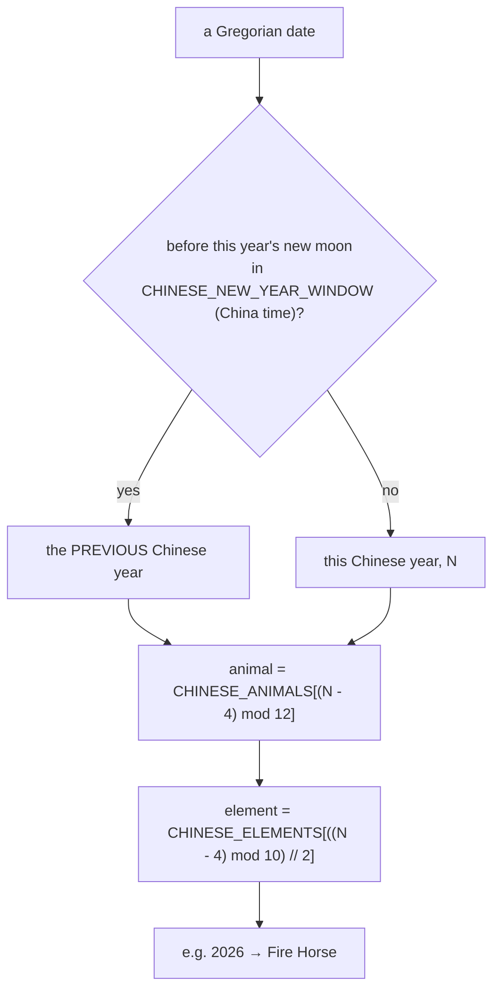
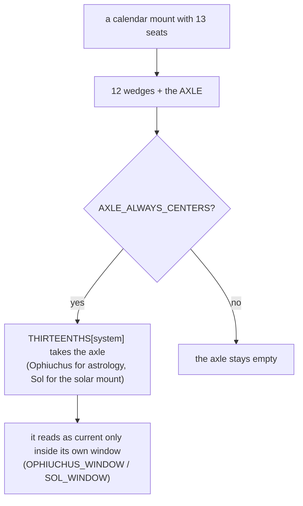

# Zodiac — Flow

**About:** [description](../__about/zodiac.md)

## Sections

```
📁 zodiac.py
  CHINESE   CHINESE_ANIMALS (12), CHINESE_ELEMENTS (5),
            CHINESE_NEW_YEAR_WINDOW, CHINA_UTC_OFFSET_HOURS,
            CHINESE_MONTH_BRANCH_ANIMALS, CHINESE_BRANCH_TERMS,
            chinese_branch_span()
  WESTERN   ZODIAC_SIGNS (12), ZODIAC_SPAN_DEG
  THE 13th  THIRTEENTHS, AXLE_ALWAYS_CENTERS,
            OPHIUCHUS_WINDOW, SOL_WINDOW, MODRENIK_WINDOW_HALF_DAYS
```

## The sexagenary year



The new-year instant is DERIVED from the bundled principal-phase
instants, shifted by `CHINA_UTC_OFFSET_HOURS` — never a hardcoded date,
so a Deep Time pack widens it for free.

## A thirteen-seat mount



Pseudocode:

    branch_of(date):
        FOR animal, (start_term, end_term) IN CHINESE_BRANCH_TERMS:
            IF date IN chinese_branch_span(start_term, end_term, date.year):
                RETURN animal

`chinese_branch_span()` is the module's only function: the branch months
are bounded by SOLAR TERMS, not by calendar days, so the span has to be
computed per year rather than written down.
