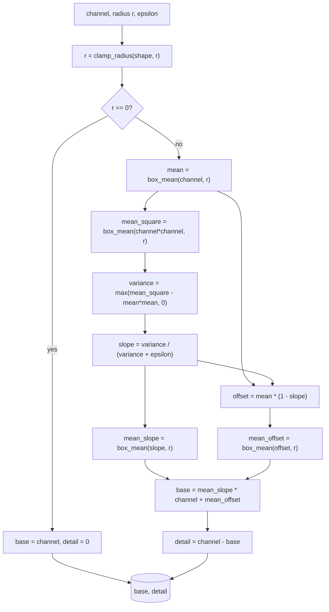

# Filters — Flow

**About:** [description](../__about/filters.md)

## Algorithm

`box_mean` itself is a two-pass cumulative-sum box filter — sum along
rows, then along columns, dividing by the same box sum taken over an
all-ones array so border pixels average only the samples that exist.

Pseudocode (language-neutral — the owner must be able to follow it in
any stack):

    BOX_SUM(source, radius):                  -- O(1) per pixel
        running cumulative sum along rows, sliced into 3 zones
            (top edge, interior, bottom edge) so every pixel sums
            exactly its (2r+1) window, clamped at the border
        repeat the same cumulative-sum trick along columns

    BOX_MEAN(source, radius) = BOX_SUM(source, radius) / BOX_SUM(ones_like(source), radius)

    CLAMP_RADIUS(shape, radius) = max(0, min(radius, (min(shape) - 2) // 2))

    GUIDED_SPLIT(channel, radius, epsilon):
        radius = CLAMP_RADIUS(channel.shape, radius)
        IF radius == 0:
            RETURN channel, zeros_like(channel)      -- too small to split
        mean         = BOX_MEAN(channel, radius)
        mean_square  = BOX_MEAN(channel * channel, radius)
        variance     = max(mean_square - mean*mean, 0)
        slope        = variance / (variance + epsilon)     -- 0 flat, 1 edge
        offset       = mean * (1 - slope)
        base         = BOX_MEAN(slope, radius) * channel + BOX_MEAN(offset, radius)
        RETURN base, channel - base                          -- exact reconstruction
