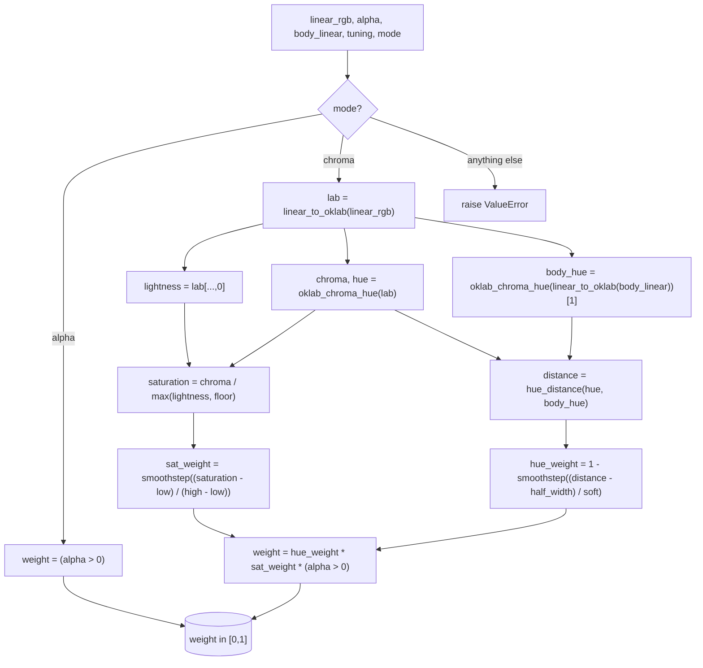

# Mask — Flow

**About:** [description](../__about/mask.md)

## Algorithm

Pseudocode (language-neutral):

    METAL_WEIGHT(linear_rgb, alpha, body_linear, tuning, mode):
        opaque = (alpha > 0)
        IF mode == "alpha":
            RETURN opaque
        IF mode != "chroma":
            RAISE error "unknown mask mode"

        lab               = OKLAB(linear_rgb)
        lightness         = lab.L
        chroma, hue       = CHROMA_HUE(lab)
        saturation        = chroma / max(lightness, BLACK_FLOOR)

        body_hue          = CHROMA_HUE(OKLAB(body_linear)).hue
        distance          = HUE_DISTANCE(hue, body_hue)          -- shortest angle, degrees

        hue_weight        = 1 - SMOOTHSTEP((distance - hue_half_width_deg) / hue_soft_deg)
        sat_weight        = SMOOTHSTEP((saturation - sat_low) / (sat_high - sat_low))

        RETURN hue_weight * sat_weight * opaque
