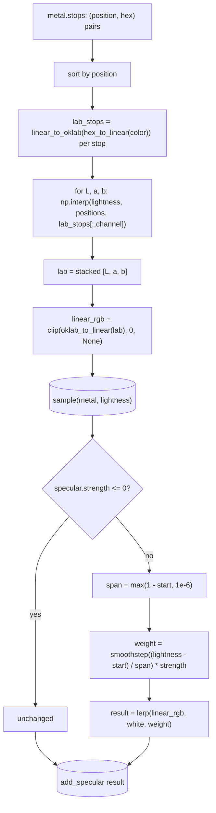

# Ramp — Flow

**About:** [description](../__about/ramp.md)

## Algorithm

`body_color(metal, position)` is `sample(metal, position)` reshaped to
`(3,)` — the ramp sampled at one scalar position.

Pseudocode (language-neutral):

    SAMPLE(metal, lightness):
        positions, colors = metal.stops, sorted by position
        lab_stops = [OKLAB(HEX_TO_LINEAR(color)) for color in colors]
        FOR each of L, a, b:
            interpolate PIECEWISE-LINEAR at `lightness` over (positions, lab_stops[channel])
                -- np.interp clamps outside the stop range, both ends
        RETURN clip(OKLAB_TO_LINEAR(stacked lab), 0, None)

    BODY_COLOR(metal, position) = SAMPLE(metal, position)

    ADD_SPECULAR(rgb, lightness, specular):
        IF specular.strength <= 0: RETURN rgb unchanged
        span   = max(1 - specular.start, 1e-6)
        weight = SMOOTHSTEP((lightness - specular.start) / span) * specular.strength
        RETURN LERP(rgb, white, weight)
