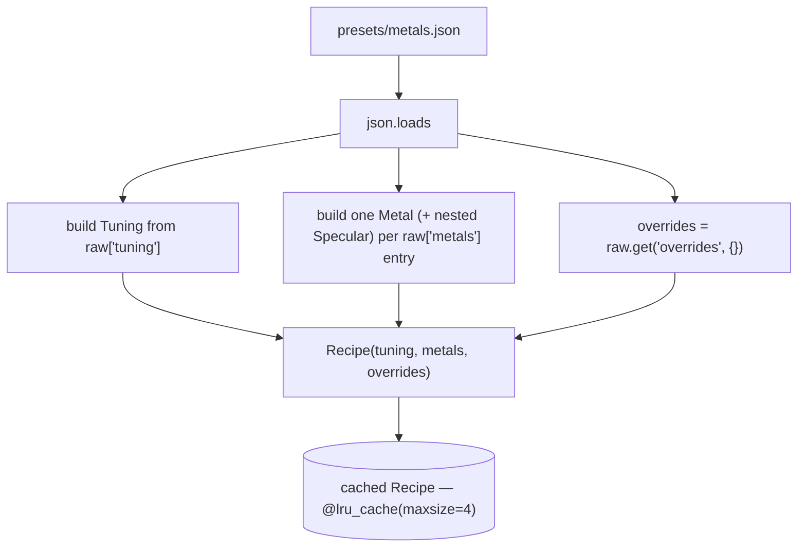

# Recipe — Flow

**About:** [description](../__about/recipe.md)

## Schema — The Config Tree

`presets/metals.json` deserializes into this shape (`load()` in
`recipe.py`); every field below is a real dataclass attribute, grouped
by which pipeline stage reads it — the same section banners the JSON
itself uses:

```
Recipe
  tuning: Tuning                    -- the shared block, identical for every image
    MASK
      hue_half_width_deg            -- hue window half-width, degrees
      hue_soft_deg                  -- soft falloff width, degrees
      saturation_ramp: (low, high)  -- chroma/lightness bounds (metal vs. stone)
      body_position                 -- ramp position sampled for a metal's body color
    DE-TINT
      detint_strength               -- 0..1, how fully the source's cast is removed
    SPLIT
      detail_radius_fraction        -- guided-filter window, fraction of the smaller side
      detail_radius_min             -- floor on the pixel radius
      detail_epsilon                -- variance floor: texture vs. edge
      detail_headroom               -- how close to black/white before detail eases down
    ANCHOR
      anchor_percentiles: (low, high)     -- percentile window mapped to [0,1]
      anchor_scale_range: (min, max)      -- bound on the resulting stretch factor
    CHROMA DETAIL
      chroma_detail_gain             -- how much residual chroma texture re-injects as darkening

  metals: dict[name -> Metal]
    Metal
      name                          -- the key it was loaded under
      stops: ((position, "#RRGGBB"), ...)   -- the ramp
      gamma                         -- tonal midpoint shift
      contrast                      -- monotone S-curve amount
      detail_gain                   -- how strongly high-frequency relief rides the curve
      specular: Specular
        start                       -- where the near-white roll-off begins
        strength                    -- how far toward white it goes

  overrides: dict[file_stem -> partial Tuning patch]   -- documented BACKUP, empty by default
```

## Load Flow



Pseudocode:

    LOAD(path = PRESETS):
        raw = JSON_PARSE(path)                 -- malformed JSON/missing key raises, no fallback
        tuning = Tuning(** every field READ from raw["tuning"], cast to float/tuple)
        metals = { name: METAL(name, entry) for name, entry in raw["metals"].items() }
        RETURN Recipe(tuning, metals, raw.get("overrides", {}))

    FOR_IMAGE(recipe, stem):
        patch = recipe.overrides.get(stem, {})
        IF patch empty: RETURN recipe unchanged
        RETURN recipe with tuning replaced by tuning patched with `patch`
