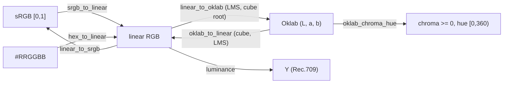

# Color Space Math — Flow

**About:** [description](../__about/space.md)

## Conversions

Pseudocode (language-neutral):

    SRGB_TO_LINEAR(srgb):
        srgb = clip(srgb, 0, 1)
        IF srgb <= 0.04045: RETURN srgb / 12.92
        ELSE: RETURN ((srgb + 0.055) / 1.055) ^ 2.4

    LINEAR_TO_SRGB(linear):                       -- inverse, piecewise the same way
        linear = clip(linear, 0, 1)
        IF linear <= 0.0031308: RETURN linear * 12.92
        ELSE: RETURN 1.055 * linear ^ (1/2.4) - 0.055

    LUMINANCE(linear_rgb) = linear_rgb . [0.2126, 0.7152, 0.0722]   -- Rec.709 dot product

    LINEAR_TO_OKLAB(linear_rgb):
        lms = clip(linear_rgb @ LMS_FROM_RGB, 0, None)   -- clamp before cube root
        RETURN cbrt(lms) @ LAB_FROM_LMS

    OKLAB_TO_LINEAR(lab):
        lms = (lab @ LMS_FROM_LAB) ^ 3
        RETURN lms @ RGB_FROM_LMS

    OKLAB_CHROMA_HUE(lab):
        chroma = hypot(lab.a, lab.b)
        hue    = degrees(atan2(lab.b, lab.a)) mod 360
        RETURN chroma, hue

    HUE_DISTANCE(hue, center) = abs((hue - center + 180) mod 360 - 180)   -- shortest arc, [0,180]

    HEX_TO_LINEAR("#RRGGBB") = SRGB_TO_LINEAR(the three byte pairs / 255)

    SMOOTHSTEP(x):
        x = clip(x, 0, 1)
        RETURN x*x*(3 - 2*x)
