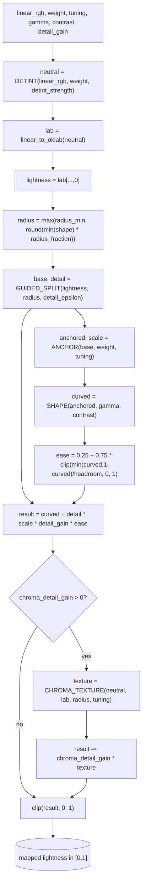

# Tone — Flow

**About:** [description](../__about/tone.md)

## Algorithm

Pseudocode (language-neutral):

    DETINT(linear_rgb, weight, strength):
        total = sum(weight)
        IF total <= 0: RETURN linear_rgb unchanged
        reference = weighted mean of linear_rgb over weight
        cast      = reference / max(LUMINANCE(reference), 1e-6)   -- unit-luminance cast
        neutral   = linear_rgb / max(cast, 1e-4)
        RETURN linear_rgb * (1-strength) + neutral * strength

    ANCHOR(base, weight, tuning):
        values = base WHERE weight > 0.5
        IF values empty: RETURN clip(base, 0, 1), 1.0
        low, high = PERCENTILE(values, tuning.anchor_percentiles)
        scale     = clip(1 / max(high - low, 1e-6), *tuning.anchor_scale_range)
        midpoint  = (low + high) / 2
        RETURN clip(0.5 + (base - midpoint) * scale, 0, 1), scale

    SHAPE(lightness, gamma, contrast):
        curved = clip(lightness, 0, 1) ^ gamma
        RETURN curved + contrast * (SMOOTHSTEP(curved) - curved)

    RELIEF(linear_rgb, weight, tuning, gamma, contrast, detail_gain):
        neutral        = DETINT(linear_rgb, weight, tuning.detint_strength)
        lab            = OKLAB(neutral); lightness = lab.L
        radius         = max(tuning.detail_radius_min,
                              round(min(lightness.shape) * tuning.detail_radius_fraction))
        base, detail   = GUIDED_SPLIT(lightness, radius, tuning.detail_epsilon)
        anchored, scale = ANCHOR(base, weight, tuning)
        curved         = SHAPE(anchored, gamma, contrast)
        ease           = 0.25 + 0.75 * clip(min(curved, 1-curved) / tuning.detail_headroom, 0, 1)
        result         = curved + detail * scale * detail_gain * ease
        IF tuning.chroma_detail_gain > 0:
            result -= tuning.chroma_detail_gain * CHROMA_TEXTURE(neutral, lab, radius, tuning)
        RETURN clip(result, 0, 1)

    CHROMA_TEXTURE(neutral, lab, radius, tuning):
        chroma, _  = CHROMA_HUE(lab)
        saturation = chroma / max(lab.L, 1e-4)
        RETURN GUIDED_SPLIT(saturation, radius, tuning.detail_epsilon).detail
