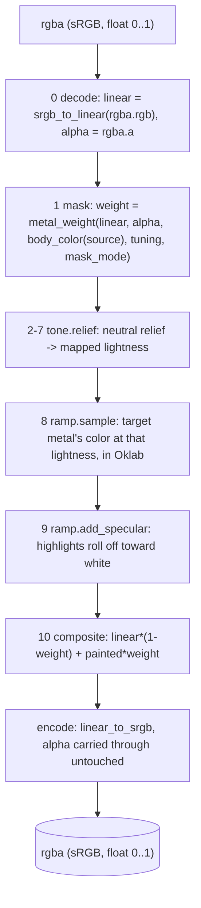

# Transform — Flow

**About:** [description](../__about/transform.md)

## The Whole Pipeline

Pseudocode (language-neutral — the owner must be able to follow it in
any stack):

    RECOLOR(rgba, source, target, recipe, mask_mode="chroma", image_key=None):
        recipe = recipe.for_image(image_key)        -- per-image BACKUP override, normally a no-op
        source_metal = recipe.metal(source)
        target_metal = recipe.metal(target)
        tuning       = recipe.tuning

        linear = SRGB_TO_LINEAR(rgba.rgb)
        alpha  = rgba.a

        weight    = METAL_WEIGHT(linear, alpha,
                                  BODY_COLOR(source_metal, tuning.body_position),
                                  tuning, mask_mode)
        lightness = RELIEF(linear, weight, tuning,
                            target_metal.gamma, target_metal.contrast, target_metal.detail_gain)
        painted   = ADD_SPECULAR(SAMPLE(target_metal, lightness),
                                  lightness, target_metal.specular)

        blended = linear * (1 - weight) + painted * weight
        RETURN SRGB_ENCODE(blended) with the original alpha, unchanged
