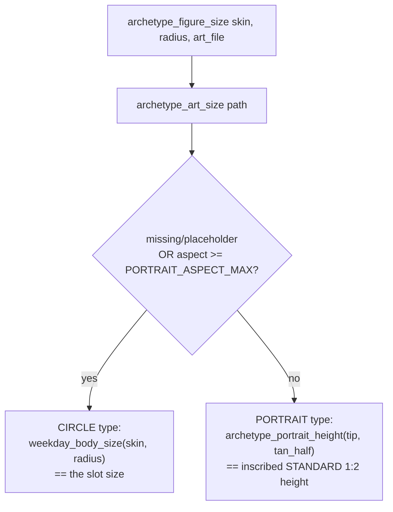

# Archetype Geometry — Flow

**About:** [description](../__about/archetype_geometry.md)

## THE TWO-TYPE LAW (`archetype_figure_size`)

Pseudocode:

    FUNCTION archetype_figure_size(skin, radius, art_file):
        size = archetype_art_size(art_file)          # None if missing/placeholder
        IF size is None OR size.width/size.height >= PORTRAIT_ASPECT_MAX:
            RETURN weekday_body_size(skin, radius)     # CIRCLE type
        tip = radius * skin.star.radius_fraction
        tan_half = tan(arm_half_deg(skin))
        RETURN archetype_portrait_height(tip, tan_half)  # PORTRAIT type

    FUNCTION archetype_portrait_height(tip, tan_half):
        # inscribes the STANDARD 1:2 aspect (not the art's own) into the
        # arm's diamond, so every portrait in a set is UNIFORM height
        RETURN tip * tan_half / (STANDARD_ASPECT + tan_half)

## The lit hour-space (`archetype_lit_index`)

    FUNCTION archetype_lit_index(pointer, hour_angle, rotation, offset):
        arms = POINTER_POINTS[pointer]
        step = 360 / arms
        RETURN round((hour_angle - rotation - offset) % 360 / step) % arms

Each space is CENTERED on its own arm and rides the solar rotation
exactly as the diamonds do, so the lit figure always matches the arm
under the hour hand.
