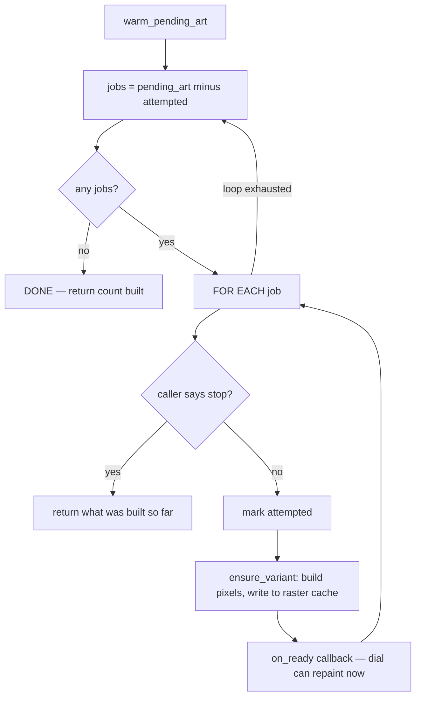

# Art Warm — Flow

**About:** [description](../__about/art_warm.md)

## The drain loop

Pseudocode:

    FUNCTION warm_pending_art(progress, on_ready, should_stop):
        attempted = {}
        built = 0
        REPEAT:
            jobs = [p FOR p IN pending_art() IF p NOT IN attempted]
            IF jobs is empty: BREAK
            FOR EACH path IN jobs:
                IF should_stop(): RETURN built
                attempted.add(path)
                ensure_variant(path)          # recolor + disk-cache write
                built += 1
                on_ready()                    # this thread; Qt marshals to GUI
        RETURN built

The REPEAT (not a single FOR) is load-bearing: the GUI thread keeps
recording new recipes while this drains, so a single pass would miss
art discovered mid-run. The `attempted` set is what turns "keep
draining until the ledger is quiet" into a loop that provably
terminates even when a write keeps failing.
