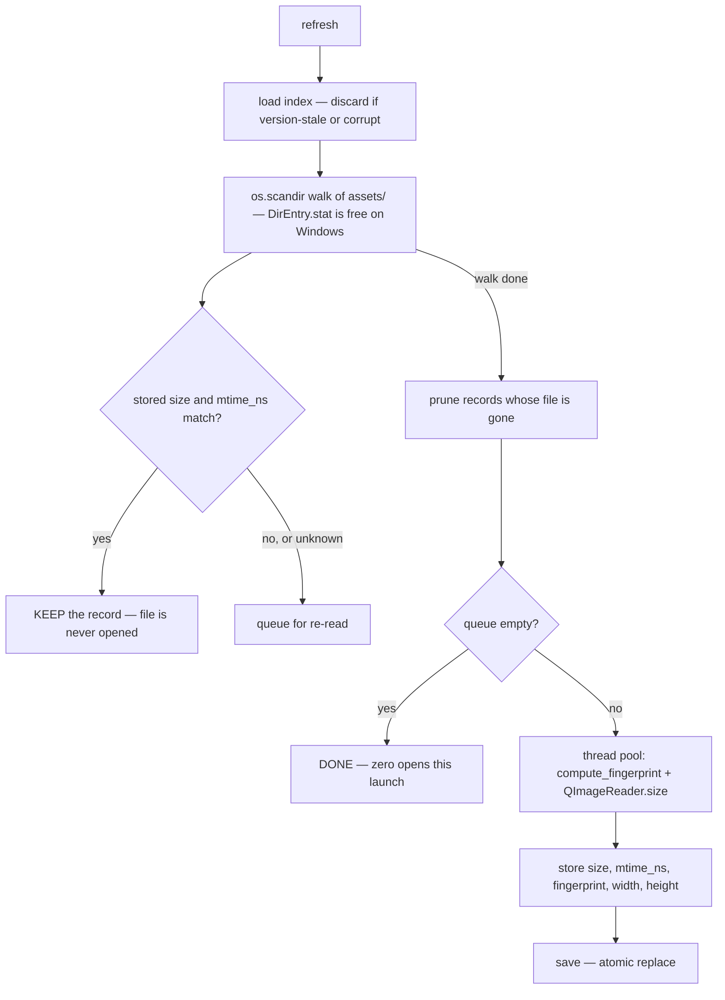
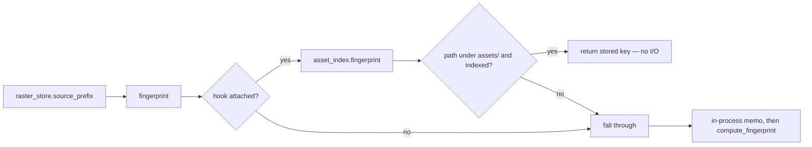

# Asset Index — Flow

**About:** [description](../__about/asset_index.md)

## The refresh walk

Pseudocode:

    FUNCTION refresh(should_stop, progress):
        load()                              # lazy, version-checked
        seen  = {}
        stale = []
        FOR EACH entry IN scandir_walk(assets_dir()):     # ~0.015 s / 2710 files
            IF should_stop(): RETURN
            rel = entry relative to assets_dir()
            seen.add(rel)
            stat = entry.stat()             # FREE — carried by the enumeration
            record = index.get(rel)
            IF record AND record.size == stat.st_size
                      AND record.mtime_ns == stat.st_mtime_ns:
                CONTINUE                    # <-- the whole point: no open
            stale.append((rel, entry.path, stat))
        FOR EACH rel NOT IN seen: index.remove(rel)       # deleted art

        IF stale is empty: RETURN (len(index), 0)

        # Only genuinely new or changed files reach here. Both calls
        # release the GIL, so a thread pool is honest parallelism.
        PARALLEL FOR EACH (rel, path, stat) IN stale:
            fingerprint = raster_store.compute_fingerprint(path)   # 64 KiB + 4 KiB
            width, height = QImageReader(path).size()              # header only
            index[rel] = [stat.st_size, stat.st_mtime_ns,
                          fingerprint, width, height]
        save()
        RETURN (len(index), len(stale))

The `CONTINUE` is the entire fix. Before this module, the equivalent
loop had no such branch — every launch fell through to the expensive
half for all 2,511 files, which is how a pass that built **zero**
images cost the owner **91.6 seconds**.

## How a reader is served

The hook is why the Encyclopedia warm needed no edit of its own: it
calls `source_prefix` hundreds of times through `variant_pending` and
`scaled_variant_file`, and each of those calls now ends at a dict
lookup instead of an `open()`.

`image_size` follows the same shape for
`asset_variants.warm_working_set`, which asked `QImageReader` for a
width it had already been told 961 times before.
