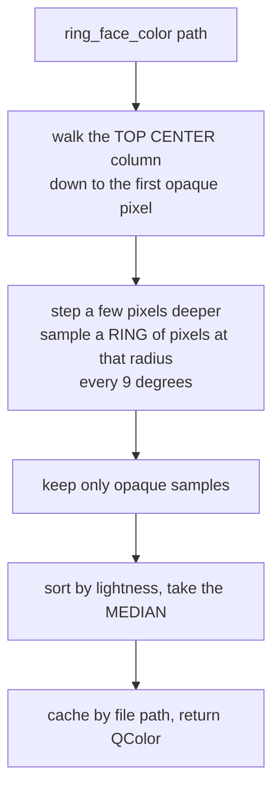

# Asset Variants — Flow

**About:** [description](../__about/asset_variants.md)

## The ring face color sample (`ring_face_color`)

The median (not the mean) is load-bearing: numerals and ticks are a
bright MINORITY of the ring band, and a median never lets a minority of
outlier-bright samples pull the face color toward white.

## The subdial plate resolution (`subdial_plate_file`)

    FUNCTION subdial_plate_file(finish, tint):
        set = config.paths.subdial_set()             # the active hand-picked set
        IF set in {"set1".."set4"}:
            RETURN assets/subdial/<set>/<finish>.png AS DRAWN   # no recolor
        IF set == "solo":
            master = the one silver file, AS DRAWN if finish == silver
            ELSE: RETURN _recolored_plate(master, finish) live   # gold/bronze derived
        IF tint given: colorize the tapisserie field to tint, on top of the above
        IF no plate art exists for this set: RETURN None          # caller draws a circle

## The working-set routing (`scaled_variant_file`)

    FUNCTION scaled_variant_file(path, width, build=True):
        cache_path = _scaled_cache_path(path, width)   # stem-readable name
        IF cache_path exists: RETURN cache_path
        IF NOT build: RETURN path                        # GUI-thread reader: never blocks
        decode `path`, downscale to `width`, encode, save to cache_path
        RETURN cache_path
