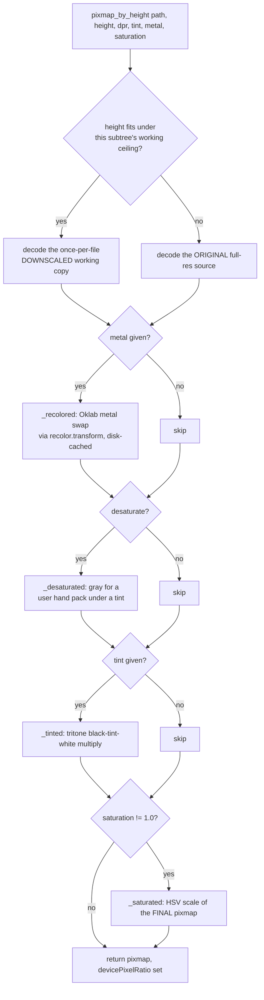

# Assets — Flow

**About:** [description](../__about/assets.md)

## The rasterize-and-recolor routing (`pixmap_by_height`)

Pseudocode:

    FUNCTION pixmap_by_height(path, height, dpr, tint, desaturate, metal, saturation):
        source = downscaled working copy IF height <= working_ceiling(path) ELSE original
        image = rasterize(source, height, dpr)          # PNG scale or SVG render
        IF metal:      image = _recolored(image, metal, source_metal, mask_mode)
        IF desaturate: image = _desaturated(image)
        IF tint:       image = _tinted(image, tint)
        IF saturation != 1.0: image = _saturated(image, saturation)
        RETURN image as QPixmap with devicePixelRatio = dpr

The four optional steps are ORDER-FIXED: metal swap first (it operates
on the source's own cast), desaturate second (grays user art before a
tint has to work on it), tint third (the ring/hand recolor), saturation
last (the Ring Saturation slider scales the fully-recolored result).
