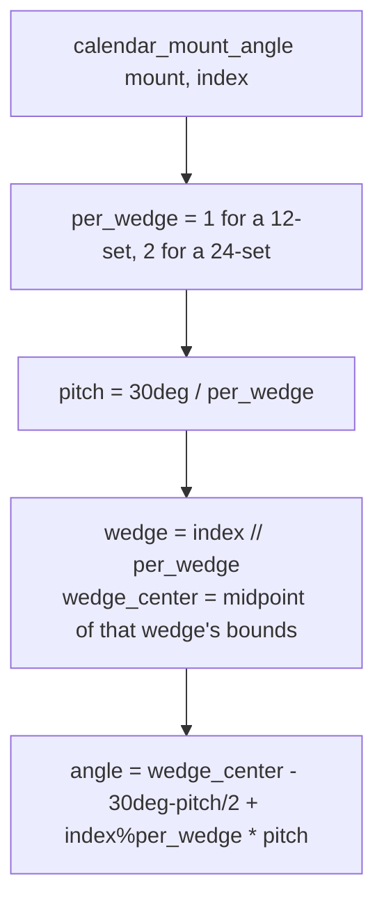

# Calendar Mount — Flow

**About:** [description](../__about/calendar_mount.md)

## THE SEAT LAW — one formula for 12 or 24 seats

Pseudocode:

    FUNCTION calendar_mount_angle(mount, index):
        per_wedge = 1 if mount.seats == 12 else 2
        wedge_index = index // per_wedge
        (start, end) = calendar_wedge_bounds(calendar_mount_wheel(mount))[wedge_index]
        pitch = 30deg / per_wedge
        first_seat = midpoint(start, end) - (30deg - pitch) / 2
        RETURN first_seat + (index % per_wedge) * pitch

    FUNCTION calendar_mount_mark_height(mount, radius):
        RETURN 2 * radius * MARK_SCALE / per_wedge   # 24-set marks halve

A 12-seat roster's bracket term is zero and the seat IS the wedge
center; a 24-seat roster's two seats land a quarter wedge either side —
a 15-degree pitch across the whole dial, the same pitch the Rose's
three stars stand on.

## Emphasis and dimming (`_draw_calendar_mount`)

    FOR EACH seat index, (name, art) IN calendar_mount_entries(mount):
        pos = dial_point(calendar_mount_angle(mount, index), mount_radius)
        IF index == chinese_mount_dimmed_index(day):   # checked FIRST
            alpha = DIMMED_ALPHA
        ELSE:
            alpha = BASE_ALPHA + (LIT_DELTA if index == current_index ELSE 0)
        IF art exists: draw_pixmap_centered(art, pos, mark_height)
        ELSE:           draw_name_label(name, pos, fitted size)
