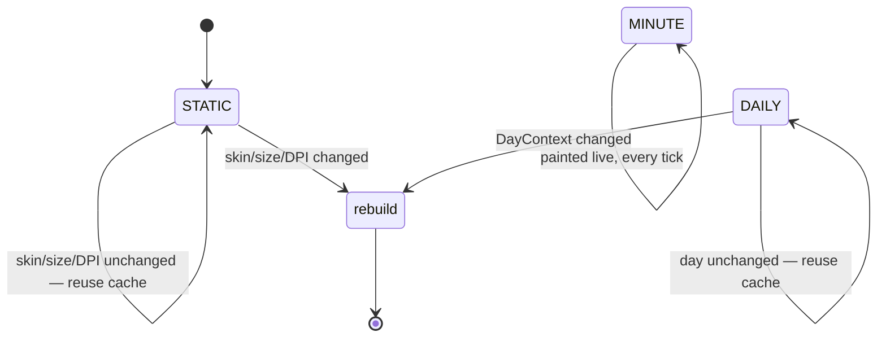

# Render Context — Flow

**About:** [description](../__about/context.md)

## The Cadence contract

A layer declares ONE `Cadence`. [Compositor](../__about/compositor.md)
groups consecutive STATIC/DAILY, non-hover-variable layers into cached
pixmaps; MINUTE and hover-variable layers always paint live.

## The base/lift gate

Every layer paints TWICE when its hovered element must ride above the
hands: once in the base pass (skips the hovered element), once in a
`lift=True` twin (paints ONLY the hovered element).

Pseudocode:

    FUNCTION _gate(ctx, element):
        RETURN (ctx.hovered == element) == self.lift
        # lift=False (base pass): draws when element is NOT hovered
        # lift=True  (HoverLiftLayer twin): draws ONLY when it IS

    FOR EACH element a layer would draw:
        IF _gate(ctx, element):
            draw it (enlarged by hover_enlarge when ctx.hovered == element)
