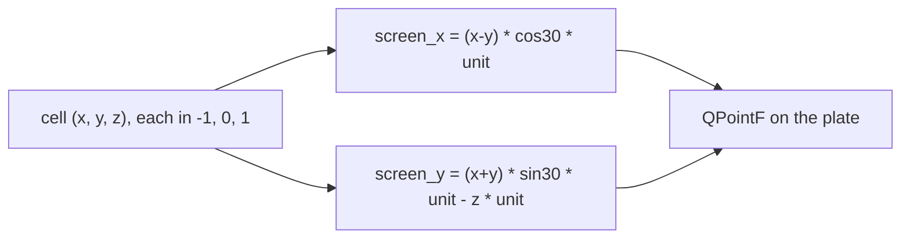

# Cube Diagrams — Flow

**About:** [description](../__about/cube_diagrams.md)

## The isometric projection

## The color law (`core.cube_seating.cell_color`, read here)

    FUNCTION cell_color(cell):
        IF cell is a face pole: RETURN its sealed ROSE_POLE_HUE
        IF cell is The One (center): RETURN the dial's accent color
        ELSE: RETURN the AVERAGE of the poles the cell stands between

## The plate cache (`plate`)

    FUNCTION plate(kind, key, size):
        cache_key = (kind, key, size)
        IF cache_key not cached:
            drawer = _DRAWERS[kind]                  # None -> QPixmap() (unknown kind)
            _CACHE[cache_key] = drawer(key, size)
        RETURN _CACHE[cache_key]

Drawing is cheap, but a page turn must never repaint the same figure
twice. The reader always REQUESTS `CUBE_DIAGRAM_SIDE_PX` and scales
that one returned pixmap itself for the page — so in practice the cache
holds one entry per (kind, key) despite being keyed on size too.
