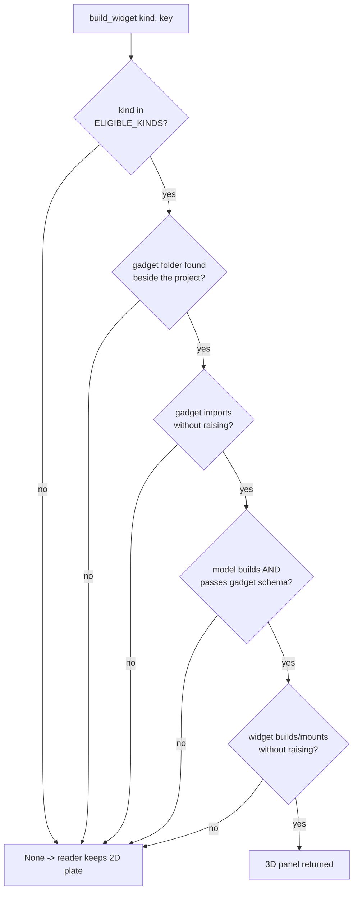

# Cube Preview3D Bridge — Flow

**About:** [description](../__about/cube_preview3d.md)

## THE FALLBACK LAW — every gate answers None, never raises

Pseudocode:

    FUNCTION build_widget(kind, key):
        IF kind NOT IN ELIGIBLE_KINDS: RETURN None
        model = _model_json()              # cached: import + build + validate, once
        IF model is None: RETURN None       # any failure along that chain, logged
        TRY:
            RETURN the panel for (kind, key)'s gadget view
        EXCEPT Exception:
            log; RETURN None

Both the gadget import (`_load_gadget`) and the model build
(`_model_json`) are memoized module singletons — a page that already
failed does not re-attempt the gadget on every subsequent open.
