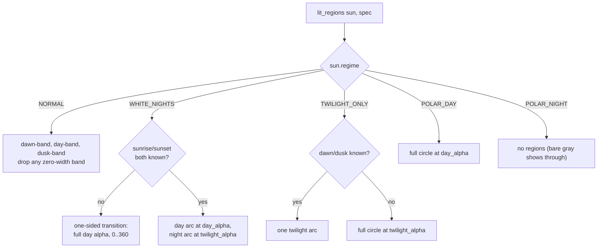

# Daylight — Flow

**About:** [description](../__about/daylight.md)

## The lit-regions regime dispatch

Pseudocode:

    FUNCTION lit_regions(sun, spec):
        SWITCH sun.regime:
            NORMAL:        arcs = [dawn->rise (twilight), rise->set (day), set->dusk (twilight)]
                            RETURN arcs with any zero-width arc dropped
            WHITE_NIGHTS:   IF sunrise or sunset missing: RETURN [(0, 360, day_alpha)]
                            RETURN [(rise, set, day_alpha), (set, rise, twilight_alpha)]
            TWILIGHT_ONLY:  IF dawn and dusk known: RETURN [(dawn, dusk, twilight_alpha)]
                            RETURN [(0, 360, twilight_alpha)]
            POLAR_DAY:      RETURN [(0, 360, day_alpha)]
            POLAR_NIGHT:    RETURN []

`border_clips` and `aurora_bands` read the SAME regime branches — a
`border_clips` call is just `lit_regions` reduced to its (start, end)
pairs, gated by `hide_night_borders` and `daylight_active`.
