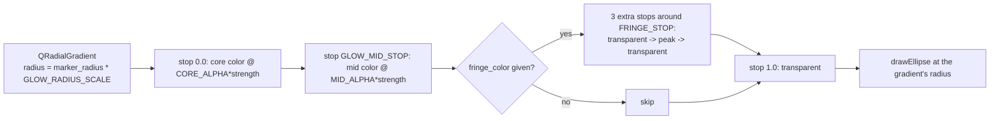

# Eclipse Glow — Flow

**About:** [description](../__about/eclipse_glow.md)

## The glow gradient (`draw_event_glow`)

## The eclipse state lookup

    FUNCTION eclipse_render_state(event):
        state = ECLIPSE_TYPE_STATE.get((event.kind, event.type))
        IF found: RETURN state
        RETURN ECLIPSE_STATE_FALLBACK[event.kind]      # documented degrade, never raise

    FUNCTION eclipse_state_glow_strength(state, magnitude):
        IF state == "solar_partial":
            RETURN eclipse_glow_strength(magnitude)      # the one magnitude-linear exception
        RETURN ECLIPSE_STATE_GLOW_STRENGTH[state]         # every other state: fixed fraction
